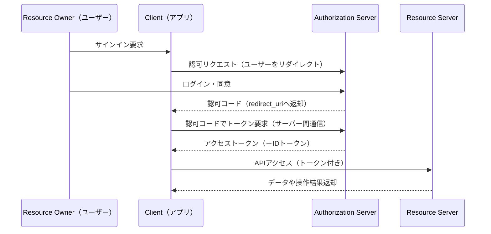

# 基本フロー：Authorization Code Flow（認可コードグラント）

---

## 概要

Authorization Code Flow（認可コードグラント）は、OAuth 2.0で最も広く使われている認可フローです。  
Webサービスやスマートフォンアプリ、API連携など、さまざまな場面で「安全かつ便利」に権限を委譲する標準的な方式です。

---

## 1. 関係者のおさらい

- **リソースオーナー（Resource Owner）：** データの所有者（通常はユーザー本人）
- **クライアント（Client）：** リソースへのアクセスを希望するWebサービスやアプリ
- **認可サーバー（Authorization Server）：** 権限を発行・管理するサーバー（例：GoogleやLINEの認可サーバー）
- **リソースサーバー（Resource Server）：** 実際にデータやAPIを持つサーバー（例：GoogleカレンダーAPI）

---

## 2. Authorization Code Flowの流れ

---

## 3. ポイント解説

- **ユーザーの認証と同意**は認可サーバーで実施され、利用者のパスワードはクライアント（サービスやアプリ）に渡りません。
- クライアントは一度「認可コード」を受け取り、バックエンドのサーバー間通信でアクセストークンを取得します。  
  → これにより、高い安全性が確保されます。
- アクセストークンを用いてリソースサーバーのAPIにアクセスできるのは、ユーザーが許可した範囲（スコープ）のみです。

---

## 4. セキュリティ上の利点

- パスワードを外部サービス（クライアント）に渡さないため、漏洩リスクを低減できます。
- 認可コードはワンタイムかつ短期間のみ有効です。トークンへの変換はクライアントのみが可能です。
- 通信はすべてHTTPSで行われ、盗聴や改ざんを防ぎます。
- 権限（スコープ）や有効期限も細かく管理でき、不要な権限の付与を防止します。

---

## 5. 実際の利用シーン

- Google、LINE、Facebookなどの「〇〇でログイン」機能
- 金融API連携（FAPI仕様などの高セキュリティ要件）
- eKYCや本人確認を伴うサービス、B2BのAPI連携

---

> Authorization Code Flowは、現代のWebサービスやAPI連携の標準的な認可方式です。  
> 安全性と利便性を両立するための必須知識ですので、しっかり理解しておきましょう。