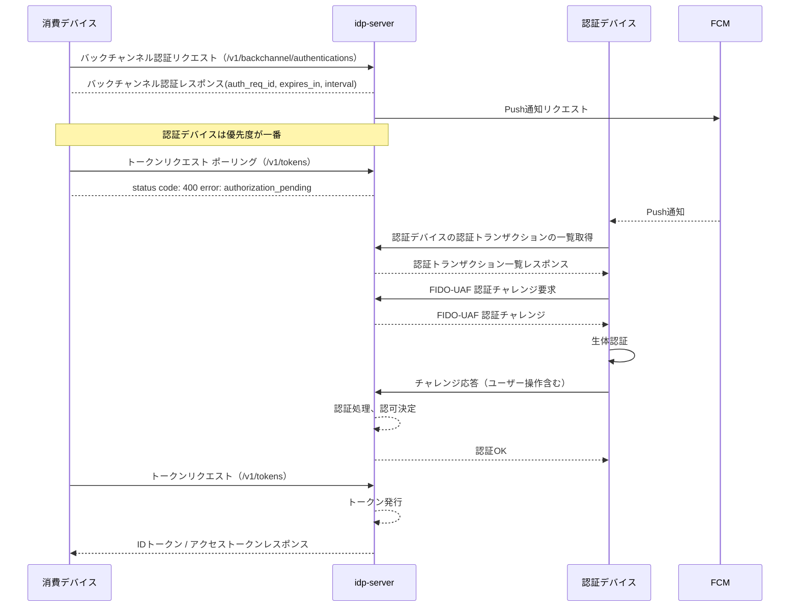
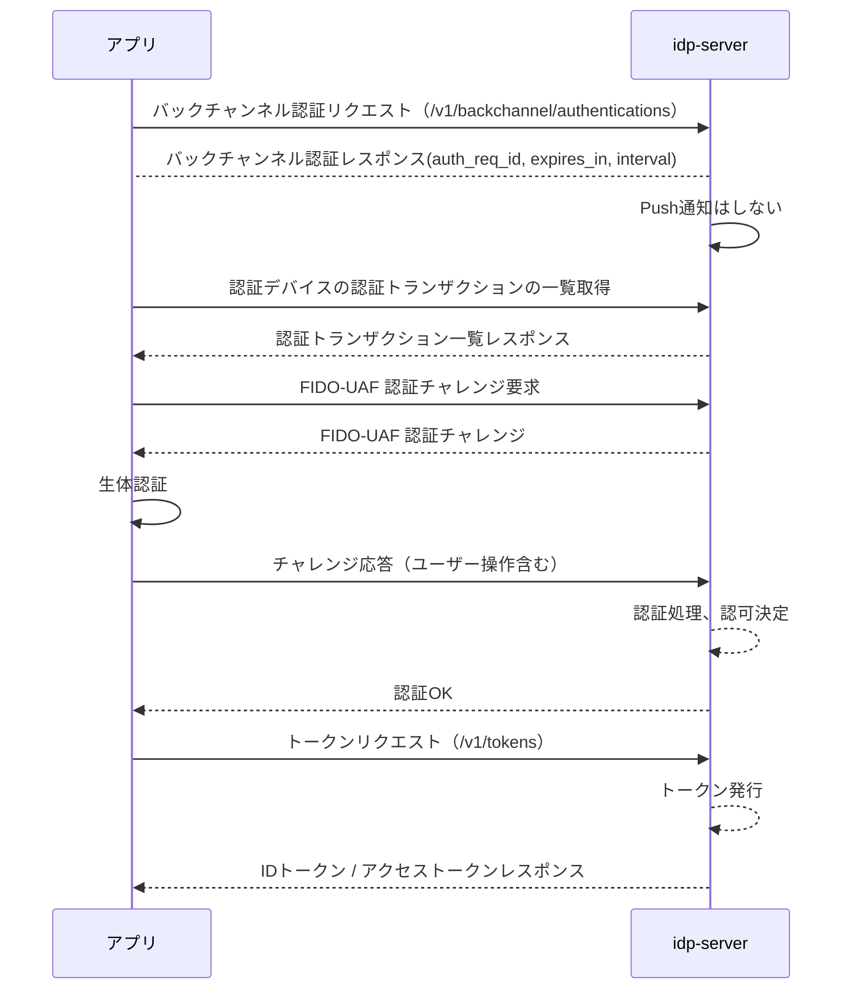

# CIBAフロー + FIDO-UAF

このドキュメントでは、`idp-server`がサポートする **CIBA (Client-Initiated Backchannel Authentication) フロー** における *
*FIDO-UAF 認証** の利用方法を説明します。

FIDO-UAF認証を利用するためには、事前にFIDO-UAFを利用できる[デバイスの登録](mfa-fido-uaf-registration.md)が必要となります。

---

## ✨ フロー全体の流れ（概要）

### 消費絵バイスと認証デバイスが異なる一般的なCIBAフロー（デカップルドフロー）



※ idp-serverとFIDOサーバーのシーケンスは、フローを簡略化するために省略しています。

### 消費絵バイスと認証デバイスが同一の場合のフロー



## CIBAフロー概要

[CIBAフロー概要](ciba-flow.md)はこちらのドキュメントを参照ください。

---

## 🔐 Backchannel Authentication リクエスト送信

CIBA（Client-Initiated Backchannel Authentication）フローのバックチャンネル認証リクエストエンドポイント。
OpenID Connect Client-Initiated Backchannel Authentication Flow - Core 1.0 に準拠しています。

```
POST /v1/backchannel/authentications
Content-Type: application/x-www-form-urlencoded

client_id=...&client_secret=...&scope=openid profile phone email&login_hint=...&binding_message=...&user_code=...&acr_values=urn:mace:incommon:iap:gold
```

### クライアント認証

| 認証方式                          | 説明                                                                   | 
|-------------------------------|----------------------------------------------------------------------|
| `client_secret_basic`         | AuthorizationヘッダにBasic認証形式で `client_id` / `client_secret` を送信（デフォルト） | 
| `client_secret_post`          | `client_id` と `client_secret` をリクエストボディに含めて送信                        |
| `client_secret_jwt`           | `client_secret` を使って署名したJWTを `client_assertion` に含めて送信               |
| `private_key_jwt`             | 秘密鍵で署名したJWTを `client_assertion` に含めて送信。公開鍵は事前に登録されている必要あり            | 
| `tls_client_auth`（mTLS）       | クライアント証明書で相互TLS認証。サーバーは証明書のSubject DNやSANでクライアントを識別                  | 
| `self_signed_tls_client_auth` | 自己署名クライアント証明書でTLS認証。証明書のフィンガープリントを事前に登録して認証を成立させる                    |

### リクエストパラメータ


| パラメータ名                  | 型             | 必須   | 説明                                                   |
|-------------------------|---------------|------|------------------------------------------------------|
| `client_id`             | string        | 条件付き | クライアントの識別子。クライアント認証方式が client_secret_basicの場合は省略可能。  |
| `client_secret`         | string        | 条件付き | クライアントシークレット。クライアント認証方式が client_secret_postの場合は必須。   |
| `scope`                 | string        | ✅    | `openid` を含める必要がある。例：`openid profile email`          |
| `login_hint`            | string        | 条件付き | ユーザーを識別するヒント。例：ユーザーIDやメールアドレス                        |
| `id_token_hint`         | string        | 条件付き | 過去のID Token。`login_hint` または `id_token_hint` のいずれか必須 |
| `binding_message`       | string        | ❌    | ユーザー端末に表示されるメッセージ（ランダムな数字など）                         |
| `requested_expiry`      | integer       | ❌    | `auth_req_id` の有効期限（秒）                               |
| `request_context`       | string        | ❌    | 認証時に使う追加情報。ユーザー通知に含めることも可                            |
| `acr_values`            | string        | ❌    | 要求する認証強度（ACR値）                                       |
| `authorization_details` | array<object> | ❌    | トランザクションの詳細要求。Rich Authorization Request対応など         |

このステップで、認証リクエストが `idp-server` に送信され、端末に通知がトリガーされます。

---

## 🛰️ 認証トランザクションの取得

```
GET /v1/authentication-device/transactions/{deviceId}?attributes.auth_req_id={auth_req_id}
```

対象となる認証トランザクション情報（ID、フロー、状態など）を取得します。

---

## ✅ FIDO-UAF認証インタラクション

FIDO-UAFは3段階のインタラクションから構成されます：

### Step 1: チャレンジ要求

```
POST /v1/authentication-device/interactions/{flow}/{transactionId}/fido-uaf-authentication-challenge
Content-Type: application/json

{
  "username": "...",
  "password": "..."
}
```

`idp-server` からFIDOチャレンジを取得し、端末で処理開始。


## Step 2: FIDO-UAF Facet 情報の取得

```
GET /.well-known/fido-uaf/facets
Content-Type: application/json
```

FIDOクライアントが信頼できるアプリとして動作するための **Facet IDリスト** を取得します。
FIDOサーバから取得したレスポンスをそのまま返却します。

---

### Step 3: チャレンジ応答（実際の認証）

```
POST /v1/authentication-device/interactions/{flow}/{transactionId}/fido-uaf-authentication
Content-Type: application/json

{
  "username": "...",
  "password": "..."
}
```

チャレンジに対して、ユーザーの生体認証などを経て署名付きレスポンスを返送。

---

## 🔑 トークン取得

```
POST /v1/oauth/token
Content-Type: application/x-www-form-urlencoded

grant_type=urn:openid:params:grant-type:ciba&auth_req_id=...&client_id=...&client_secret=...
```

認証成功により、IDトークンとアクセストークンを取得します。

---

## 👁️ IDトークン / アクセストークンの検証

取得したIDトークンおよびアクセストークンは、以下のエンドポイントで取得したJWKSを用いて検証可能です：

```
GET /v1/public/jwks
```

検証後、`amr`（Authentication Method Reference）に `fido` などの値が含まれることを確認します。

---

## 🎉 まとめ

このように `idp-server` のCIBAフローは、FIDO-UAFによる強固な認証と非同期のユーザーインタラクションを組み合わせることで、

* ユーザー体験の向上
* 高いセキュリティ

を同時に実現します！

FIDO対応アプリと連携する場合、このチャレンジインタラクションを通じたデバイス認証は超強力な武器になるで！

必要があれば、チャレンジペイロードの形式もドキュメント化できるよ✨
