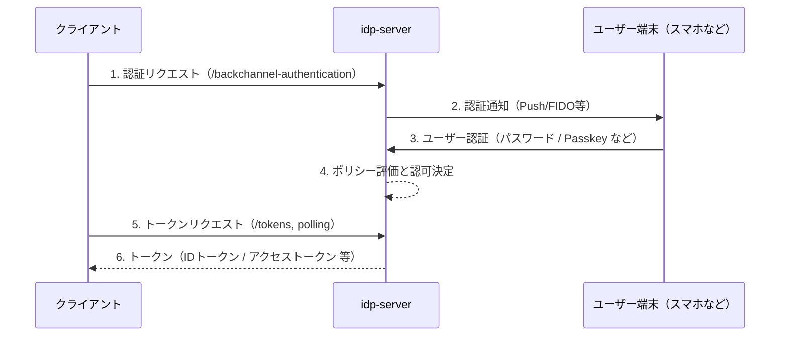

# CIBA フロー

## 概要

`idp-server` は、OpenID Connect
の拡張仕様である [OpenID Connect CIBA (Client Initiated Backchannel Authentication)](https://openid.net/specs/openid-client-initiated-backchannel-authentication-core-1_0.html)
をサポートしています。

スマートフォン等のユーザー操作可能な端末を用いた非同期認証を実現し、以下のようなユースケースに最適です。

- 生体認証・FIDOを用いたリモート承認
- 金融機関の第二要素としての身元確認

## シーケンス（抽象）

## login_hint

`idp-server` は CIBA フローの login_hint パラメータに対して、複数の識別子形式をサポートしています。これにより、柔軟なユーザー特定が可能です。

CIBA 仕様 に準拠し、login_hint はユーザー識別のヒントとして使用されます。

### サポート形式

以下のような接頭辞つきの拡張形式に対応しており、ユーザーの識別方法を柔軟に指定できます：

| フォーマット                           | 意味              | 例                                  |
|----------------------------------|-----------------|------------------------------------|
| `sub:<subject>`                  | 内部ユーザーIDで直接識別   | `sub:abc123`                       |
| `ex-sub:<subject>,<id-provider>` | 外部IdPのサブジェクトで識別 | `ex-sub:ex-idp123,ex-idp`          |
| `email:<email>,<id-provider>`    | メールアドレスによる識別    | `email:foo@example.com,idp-server` |
| `phone:<number>,<id-provider>`   | 電話番号による識別       | `phone:09012345678,idp-server`     |

※ `id-provider` のデフォルト値は `idp-server`となります。 フェデレーションによる外部IdPを利用してユーザーを作成している場合は、外部IdPプロバイダー名を指定することができます。

## ユーザー通知・端末連携

- 通知は FCM (Firebase Cloud Messaging) や APNs を介してスマホに送信します。
- 認証内容（取引明細など）は `authentication_context` 経由で端末に提示

## 認証方式

CIBA フローにおけるユーザー認証も、通常の認可コードフローと同様に認証ポリシーに従い実行されます。

- Password 認証
- Passkey 認証
- FIDO-UAF 認証
- Email / SMS OTP
- 認可内容に応じた多段認証

## 認証ポリシー（概要）

通常の認可コードフローと同様に、認可対象のスコープ・acr_values などを条件に、認証の強度を制御することができます。

## デリバリーモード

`idp-server`は Poll・Push・Pingの3つのモードをサポートしています。

| 項目     | 説明                                                       | 備考                       |
|--------|----------------------------------------------------------|--------------------------|
| `Poll` | クライアントからポーリングを実施しトークンを取得する方式。                            |                          |
| `Push` | ユーザーの認証認可が完了した場合に、idp-serverからクライントにトークンをWebhookで連携する方式。 | FAPIでは利用不可。              |
| `Ping` | ユーザーの認証認可が完了した場合に、idp-serverからクライントに完了通知をWebhookで連携する方式。 | クライントで完了通知を受け取るAPIの開発が必要 |

## 設定項目

`idp-server`は、標準仕様に準拠した設定をサポートしています。

### 拡張設定

また、仕様には定義されていないけれど、CIBAフローを実現するために必要な項目も設定が可能となっています。

| 項目                                   | 説明               | デフォルト |
|--------------------------------------|------------------|-------|
| `backchannel_auth_request_expire_in` | 認証リクエストの有効期限     | 300秒  |
| `backchannel_auth_polling_interval`  | ポーリング間隔（pollモード） | 5秒    |

## FAPI

- CIBA フローでも FAPI に対応しています。

## 便利機能

通常の認可コードフローと同様に、便利機能を利用することができます。

主な便利機能

1. claims:xx スコープによるIDトークンクレームの動的設定
2. verified_claims:xx スコープによるアクセストークンのプロパティの動的設定
