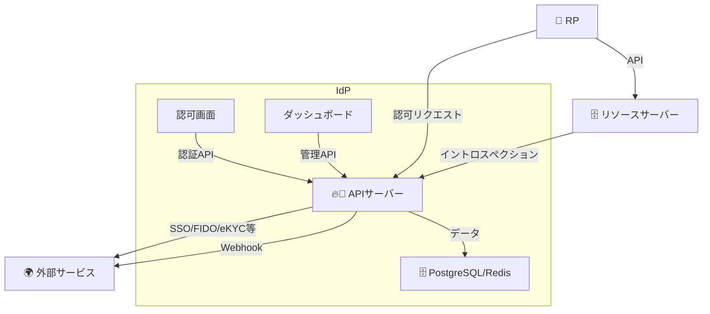

# 技術概要

## `idp-server` の特徴とは？

`idp-server` は**マルチテナントを前提にした拡張可能なアイデンティティプロバイダー**です。

OAuth 2.0、OpenID Connect(OIDC)、CIBA、FAPI、そして OIDC IDA(IDA) をサポートし、今後のOAuth
OIDCの拡張仕様の追加に対応できるようにプラガブルな設計になっています。

さらに、idp-server は今後の [Trusted Web](https://trustedweb.go.jp/about/) の拡大を見据えて、身元確認済みのID（Verified ID）を安全かつ信頼性高く発行・管理・共有する機能を備えています。電子的本人確認（eKYC）によって取得された情報をもとに、OIDCの verified_claims の連携にも対応しており、信頼性の高いID連携基盤として活用できます。

## システム構成

本システムは、以下の主要コンポーネントからなる 認証・認可プラットフォームです。
RP（Relying Party）からの認証リクエストを受け付け、必要に応じて外部サービスやデータベースと連携することで、安全性・拡張性・運用性のバランスが取れたIdP基盤を実現します。

### 提供されるモジュール

| コンポーネント       | 説明                                                                    |
|---------------|-----------------------------------------------------------------------|
| 🔥 APIサーバー    | OAuth2/OIDC/CIBAなどのリクエスト処理。認証・認可・セッション・トークン発行を担当。FederationやFIDO2にも対応 |
| 🧍‍♂️ 認可画面    | 認証時に表示されるログインUI・同意画面などを提供。SSOやMFAにも対応                                 |
| 📊 ダッシュボード    | 管理者向けGUI。クライアント設定やテナント管理、監査ログの確認などが可能                                 |
| 🧠 DB / キャッシュ | PostgreSQLとRedisを併用し、永続データ・セッション・一時キャッシュを効率的に管理                       |

### 提供対象外（外部との連携）

| コンポーネント              | 説明                                         |
|----------------------|--------------------------------------------|
| 🎯 RP（Relying Party） | 本IdPを利用するクライアントアプリ（例: Webアプリ・ネイティブアプリなど）   |
| 🗄️ リソースサーバー         | アクセストークンを元に保護リソースを提供する外部API                |
| 🌍 外部サービス            | eKYCサービス、通知基盤（FCMなど）、Federation先IdPなどと連携可能 |

## 機能

idp-server は、OAuth 2.0 / OpenID Connect を中心に、最新の認証・認可プロトコルを柔軟にサポートするための多機能なIdPプラットフォームです。

- 標準仕様に準拠した 認証・認可処理
- ユーザー体験を高める 多様な認証方式（FIDO2 / パスワード / デバイス等）
- セキュリティ要件に応じた MFA / SSF / Federation 対応
- プラグイン可能なアーキテクチャ により、要件に応じた機能拡張が可能
- マルチテナント管理 / 通知連携 / イベントフック など、エンタープライズ対応も視野に入れた設計

このセクションでは、idp-server の各機能をモジュール単位で整理し、全体像を視覚的・構造的に把握できるようにしています。

### 機能スタック図

[//]: # (![]&#40;content_01_intro/function-stack.png&#41;)

[//]: # (![]&#40;content_01_intro/function-stak-notes.png&#41;)

| モジュール               | 概要                                                                                                                                                                                                                                          |
|---------------------|---------------------------------------------------------------------------------------------------------------------------------------------------------------------------------------------------------------------------------------------|
| 🔷 **Core**         | 認証・認可の中核モジュール。OAuth 2.0 / OpenID Connect に準拠し、`Identity` や `認証ポリシー`、`認可プラグイン` などを提供                                                                                                                                                         |
| 🧩 **Core拡張機能**     | 標準仕様を補完・強化する拡張モジュール。`CIBA`, `DPoP`, `FAPI`, `FAPI2(予定)`, `PKCE`, `VC`, `IDA`, `デバイスフロー(予定)` などを提供                                                                                                                                           |
| 🔐 **認証機能**         | ユーザー認証を構成する認証手段群。`FIDO2 / Passkey`, `FIDO-UAF`, `SMS`, `Email`, `Password`, `デバイス認証`, `レガシーIDサービス連携` など                                                                                                                                     |
| 🌐 **フェデレーション機能**   | 外部IdPとのSSO連携に対応。現在は `OIDC` をサポートし、将来的に `SAML`, `LDAP` の拡張も予定                                                                                                                                                                                |
| 🔔 **通知機能**         | ユーザーへの通知を行うモジュール。`FCM`, `Email`, `SMS` による配信をサポート                                                                                                                                                                                           |
| ⚠️ **セキュリティイベント機能** | ユーザーやシステム操作に基づくイベント通知を外部に送信。`Webhook`, `Slack`, `Datadog` 連携、および `SSF` (Shared Signals Framework) に対応（Push／Pull）                                                                                                                            |
| 🧱 **Platform**     | `idp-server` 全体を支える基盤機能群。`セッション・Cookie管理`, `マルチテナンシー`, `セキュリティイベント`, `ロギング`, `トランザクション`, `DI`, `SQL`, `キャッシュ`, `証明書管理`, `CORS制御`, `通知`, `プラグインベース`, `FaaS機能` に加えて `JOSE(JWT)`, `X509`, `Random`, `UUID`, `Crypto`, `Base64` などの共通ユーティリティを統合 |

### 機能拡張について

`idp-server`は機能拡張可能なPluginのインターフェースを用意しています。

**Plugin インターフェース一覧**

`idp-server`は29個のPlugin interfacesを提供し、各機能領域での拡張に対応しています。

### 認証 (Authentication) - 8個

| Pluginインターフェース | パッケージ | 用途 |
|-------------------|---------|------|
| `AuthenticationInteractorFactory` | `org.idp.server.core.openid.authentication.plugin` | カスタム認証方式のインタラクター作成 |
| `AuthenticationExecutorFactory` | `org.idp.server.core.openid.authentication.interaction.execution` | 認証実行ロジックのエグゼキューター作成 |
| `AuthenticationDeviceNotifier` | `org.idp.server.authentication.interactors.device` | デバイス認証時の通知機能 |
| `AuthenticationDeviceNotifierFactory` | `org.idp.server.authentication.interactors.device` | デバイス通知機能のファクトリー |
| `WebAuthnExecutor` | `org.idp.server.authentication.interactors.webauthn` | WebAuthnチャレンジ・検証処理 |
| `WebAuthnExecutorFactory` | `org.idp.server.authentication.interactors.webauthn` | WebAuthn実行エンジンのファクトリー |
| `AuthenticationDependencyProvider` | `org.idp.server.core.openid.authentication.plugin` | 認証コンポーネントの依存関係提供 |
| `FidoUafAdditionalRequestResolver` | `org.idp.server.authentication.interactors.fidouaf.plugin` | FIDO-UAF追加リクエストパラメータ解決 |

### 認可・クライアント認証 (Authorization & Client Authentication) - 4個

| Pluginインターフェース | パッケージ | 用途 |
|-------------------|---------|------|
| `AuthorizationRequestExtensionVerifier` | `org.idp.server.core.openid.oauth.verifier` | 認可リクエストの拡張検証ロジック |
| `AuthorizationRequestVerifier` | `org.idp.server.core.openid.oauth.verifier` | 認可リクエストのコア検証機能 |
| `AuthorizationRequestObjectFactory` | `org.idp.server.core.openid.oauth.factory` | カスタム認可リクエストオブジェクト作成 |
| `ClientAuthenticator` | `org.idp.server.core.openid.oauth.clientauthenticator.plugin` | カスタムクライアント認証方式 |

### トークン処理 (Token Processing) - 4個

| Pluginインターフェース | パッケージ | 用途 |
|-------------------|---------|------|
| `OAuthTokenCreationServiceFactory` | `org.idp.server.core.openid.token.plugin` | カスタムOAuthトークン作成サービス |
| `AccessTokenCustomClaimsCreator` | `org.idp.server.core.openid.token.plugin` | アクセストークンへのカスタムクレーム追加 |
| `CustomIndividualClaimsCreator` | `org.idp.server.core.openid.identity.id_token.plugin` | IDトークンの個別カスタムクレーム作成 |
| `AuthorizationCodeGrantVerifierInterface` | `org.idp.server.core.openid.token.verifier` | 認可コードグラント検証 |

### フェデレーション (Federation) - 4個

| Pluginインターフェース | パッケージ | 用途 |
|-------------------|---------|------|
| `FederationInteractorFactory` | `org.idp.server.core.openid.federation.plugin` | 各種フェデレーション方式のインタラクター作成 |
| `FederationDependencyProvider` | `org.idp.server.core.openid.federation.plugin` | フェデレーションコンポーネントの依存関係提供 |
| `OidcSsoExecutorFactory` | `org.idp.server.federation.sso.oidc` | OIDC SSO実行エンジンのファクトリー |
| `UserinfoExecutor` | `org.idp.server.federation.sso.oidc` | 外部IdPからのユーザー情報取得実行 |

### セキュリティイベント (Security Events) - 1個

| Pluginインターフェース | パッケージ | 用途 |
|-------------------|---------|------|
| `SecurityEventHookFactory` | `org.idp.server.platform.security.hook` | セキュリティイベント監視・フック作成 |

### 通知 (Notification) - 3個

| Pluginインターフェース | パッケージ | 用途 |
|-------------------|---------|------|
| `EmailSender` | `org.idp.server.platform.notification.email` | Eメール送信機能実装 |
| `EmailSenderFactory` | `org.idp.server.platform.notification.email` | Eメール送信機能のファクトリー |
| `SmsSender` | `org.idp.server.platform.notification.sms` | SMS送信機能実装 |

### 監査ログ (Audit Log) - 1個

| Pluginインターフェース | パッケージ | 用途 |
|-------------------|---------|------|
| `AuditLogWriterProvider` | `org.idp.server.platform.audit` | 監査ログ書き込み機能提供 |

### プラットフォーム (Platform) - 2個

| Pluginインターフェース | パッケージ | 用途 |
|-------------------|---------|------|
| `ApplicationComponentProvider` | `org.idp.server.platform.dependency` | アプリケーションレベルのコンポーネント依存関係提供 |
| `ProtocolProvider` | `org.idp.server.platform.dependency.protocol` | プロトコル固有の依存関係・設定提供 |

### 身元確認 (Identity Verification) - 2個

| Pluginインターフェース | パッケージ | 用途 |
|-------------------|---------|------|
| `AdditionalRequestParameterResolverFactory` | `org.idp.server.core.extension.identity.verification.application.pre_hook.additional_parameter` | 身元確認時の追加リクエストパラメータ解決 |
| `UserLifecycleEventExecutorFactory` | `org.idp.server.core.openid.identity.event` | ユーザーライフサイクルイベント実行エンジン作成 |

#### 機能拡張の手順

**idp-serverの追加開発時**

1. インターフェースを実装
2. `resources/META-INF/services` 配下にインターフェースのクラスパスのファイルを追加
   1. 例：org.idp.server.core.openid.token.plugin.AccessTokenCustomClaimsCreator
3. 2のファイルに1で実装したクラスパスを定義
   1. 例：org.idp.server.core.extension.identity.verified.AccessTokenSelectiveVerifiedClaimsCreator

**外部モジュールによる機能拡張**

1. インターフェースを実装
2. `resources/META-INF/services` 配下にインターフェースのクラスパスのファイルを追加
   1. 例：org.idp.server.core.openid.token.plugin.AccessTokenCustomClaimsCreator
3. 2のファイルに1で実装したクラスパスを定義
   1. 例：org.idp.server.core.extension.identity.verified.AccessTokenSelectiveVerifiedClaimsCreator
4. idp-serverの実行環境のpluginsディレクトリ配下に実装したjarを配置します。
5. idp-serverを再起動しモジュールを読み取ります。

---
