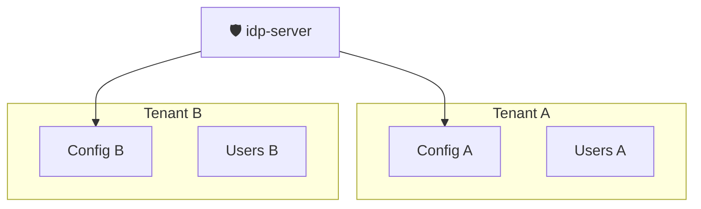

# マルチテナント

`idp-server` は 1サービスで、複数のテナントを運用できるマルチテナント型のアプリケーションです。

## 🏷️ テナントとは？

**テナント（Tenant）** とは、`idp-server` を共有する中で独立した設定やデータ空間を持つ単位です。

例えば：

* サービスごとに独自の認証ポリシーやMFA設定を持たせたい場合
* 開発環境と本番環境を分離したい場合
* サービス提供先ごとにIdPの挙動を切り替えたい場合

といったニーズに対応するため、**idp-server** はすべての機能をテナント単位で制御・分離できる設計になっています。

### 導入パターン例

- グループ会社ごとに分離してIdPを提供（B2B）
- 開発・ステージング・本番の分離（DevOps）
- ホワイトラベルSaaSの提供元が、顧客ごとにIdPをカスタマイズ（OEM型）

---

## 設定ガイド

テナント単位で設定可能な機能をカテゴリごとに紹介し、主なカスタマイズポイントをまとめます。

👉 [📄 idp-server 機能一覧（Googleスプレッドシート）](https://docs.google.com/spreadsheets/d/1jxb2y3V0M4ZXW2TSq3sQWV6ECBVOH8StpDaqqqqYlW0/edit?usp=sharing)

| 大分類      | 中分類          | 機能                             | 概要                                                                                                                                                                                                                                                                                                                                                                      | カスタマイズ                                                                           | 設定詳細 | 備考                                                                                                                                                                                             |
|:---------|:-------------|:-------------------------------|:------------------------------------------------------------------------------------------------------------------------------------------------------------------------------------------------------------------------------------------------------------------------------------------------------------------------------------------------------------------------|:---------------------------------------------------------------------------------|:-----|:-----------------------------------------------------------------------------------------------------------------------------------------------------------------------------------------------|
| ID       | ユーザー登録       | 標準                             | ユーザーがメールアドレスやパスワードなどの情報を入力して、自らアカウントを作成する標準的な登録方式です                                                                                                                                                                                                                                                                                                                     | * 初期登録ユーザー属性  * パスワード認証強度                                                   |      |                                                                                                                                                                                                |
|          | MFA登録        | 標準                             | ユーザーのMFA（多要素認証）手段を登録・管理する標準機能を提供します。 ユーザーごとにSMS・メール・FIDO2・TOTPなどのMFA手段を登録可能 登録は初回ログイン時・設定画面・認証フロー中など、柔軟にトリガー可能 登録されたMFA手段は、認可ポリシーやACRに応じて自動選択される この機能により、セキュリティ要件やUXに応じたMFA体験の構築が可能になります。                                                                                                                                                                               | -                                                                                |      |                                                                                                                                                                                                |
|          | 身元確認済みID     | 身元確認の申込みから利用するパターン             | アプリからeKYC申込みを開始し、idp-serverを介して外部身元確認サービスと連携。審査結果を元に verified_claims を更新します。                                                                                                                                                                                                                                                                                            | * 申込内容 申込内容の検証  * 申込内容の永続化対象の選定  * 身元確認済みクレームの組み立て                     |      |                                                                                                                                                                                                |
|          |              | 身元確認結果を直接登録するパターン              | 外部身元確認サービスで取得済みのeKYC結果を、直接idp-serverへ登録し、ユーザーのverified_claimsに反映します。                                                                                                                                                                                                                                                                                                    | * 身元確認済みクレームの組み立て                                                                |      |                                                                                                                                                                                                |
| フェデレーション | OIDC         | 標準                             | OpenID Connect（OIDC）に準拠した外部IdPとの連携により、シングルサインオン（SSO）を実現します。 外部IdP経由で認証されたユーザーを、idp-server にマッピングしてログインさせることができます。複数のIdPやロジックを柔軟に組み合わせる構成も可能です。                                                                                                                                                                                                                          | -                                                                                |      |                                                                                                                                                                                                |
|          |              | Facebook                       | Facebookアカウントによるソーシャルログインを提供します。 OpenID ConnectをベースとしたFacebook独自プロトコルを利用して、Facebookで認証されたユーザーを idp-server に自動マッピングし、シームレスにサービスへログイン可能にします。 ユーザー登録・紐付けの自動化にも対応できます。                                                                                                                                                                                                      | -                                                                                |      |                                                                                                                                                                                                |
|          |              | 拡張                             | OpenID Connectベースの外部IdPとのSSO連携において、標準仕様ではカバーできない要件に対応するための拡張機構です。 認証リクエスト・認証レスポンスの処理中に、独自ロジックを挿入したり、Claimの変換・属性の追加処理などを行うことができます。 既存IdPの特殊仕様や、追加の本人確認、社内ポリシーに基づく連携処理が必要なケースに適しています。                                                                                                                                                                                     | * Javaインターフェースの実装                                                                |      |                                                                                                                                                                                                |
|          | SAML2.0（予定）  | 標準                             | SAML 2.0 に準拠した外部IdPとのフェデレーション（SSO）連携をサポートします。 大学・企業などで広く使われているSAMLプロトコルを通じて、外部IdPで認証されたユーザーを idp-server にマッピングし、サービスへシームレスにログインさせることができます。 IdP-Initiated / SP-Initiated の両方のフローに対応可能です。                                                                                                                                                                                 | -                                                                                |      |                                                                                                                                                                                                |
|          |              | 拡張                             | SAML 2.0 認証後の処理に柔軟な拡張ポイントを提供します。 標準的なSAML認証フローに加えて、認証後に任意のビジネスロジックや属性変換処理を組み込むことができ、カスタムなアカウントマッピングやユーザー属性の制御に対応可能です。 SAML連携後の追加チェックや権限付与、社内システムとの連携にも活用できます。                                                                                                                                                                                                           | * Javaインターフェースの実装                                                                |      |                                                                                                                                                                                                |
| 認証       | パスワード認証      | 標準                             | ユーザー名とパスワードを用いた一般的な認証方式。パスワードの強度やリトライ制限はテナントごとに柔軟に設定できます。                                                                                                                                                                                                                                                                                                               | ログインヒントの選択  * email  * 携帯電話番号  * id                               |      |                                                                                                                                                                                                |
|          | SMS認証        | 外部SMS認証サービス                    | 外部のSMS認証サービスと連携し、ユーザー本人確認を実施します。 SMSの送信だけでなく、認証コードの生成・送信・検証など、認証フロー全体を外部サービスに委譲する構成です。 idp-server はユーザー識別情報を外部サービスに渡し、認証結果を受け取ることで連携します。 自社で認証ロジックを構築せずに、高信頼なSMS認証を組み込むことができます。                                                                                                                                                                                         | -                                                                                |      |                                                                                                                                                                                                |
|          |              | dp-server + 外部SMS送信サービス        | 外部のSMS配信サービス（例：Twilio、Nexmo など）を通じて、ワンタイムパスコード（OTP）によるSMS認証を提供します。 idp-server はSMSの送信処理を持たず、設定に応じて外部サービスを呼び出し、ユーザーの電話番号に認証コードを送信します。 送信されたコードの入力確認によって、2要素認証や本人確認フローを実現できます。                                                                                                                                                                                            | * メッセージテンプレート  * 認証コード有効期限  * リトライ上限回数                                 |      |                                                                                                                                                                                                |
|          | Emai認証       | 外部Email認証サービス                  | 外部のEmail認証サービスと連携し、ユーザー本人確認を実施します。 Emailの送信だけでなく、認証コードの生成・送信・検証など、認証フロー全体を外部サービスに委譲する構成です。 idp-server はユーザー識別情報を外部サービスに渡し、認証結果を受け取ることで連携します。 自社で認証ロジックを構築せずに、高信頼なEmail認証を組み込むことができます。                                                                                                                                                                                   | -                                                                                |      |                                                                                                                                                                                                |
|          |              | idp-server + 外部サービスによるEmail送信  | ユーザーのメールアドレスを使った本人確認に対応します。 認証ロジック（コード生成、検証、状態管理など）は idp-server が制御し、メールの送信部分だけを外部のメール送信サービス（SendGrid, SES など）に委ねます。 テンプレートのカスタマイズや、メール内容に含めるUIパラメータも柔軟に制御でき、認証体験を自社サービスに最適化できます。                                                                                                                                                                                       | * メッセージテンプレート  * 認証コード有効期限  * リトライ上限回数                                 |      |                                                                                                                                                                                                |
|          |              | idp-server + SMTPによるEmail送信    | ユーザーのメールアドレスによる本人認証に対応し、メールの送信も含めて idp-server 単体で完結する構成です。 SMTP設定（SMTPホスト、ポート、認証情報など）を行うことで、外部のメール送信サービスを使わず、自社のSMTPサーバーやGmail SMTP経由で直接メールを送信できます。 インターネット接続制限がある環境や、外部サービスに依存せずに閉じたネットワーク内で完結したい場合に有効です。                                                                                                                                                              | * メッセージテンプレート  * 認証コード有効期限  * リトライ上限回数                                 |      |                                                                                                                                                                                                |
|          |              | idp-server + AWS SESによるEmail送信 | Amazon Simple Email Service（SES）と連携することで、スケーラブルかつ信頼性の高いメール認証機能を提供できます。 メールテンプレートの管理や送信制御は idp-server 側で行い、メール送信処理はAWS SESに委譲する構成です。 高い配信成功率やスパムフィルタ耐性が求められる環境、または大規模なトランザクションメール運用に最適です。                                                                                                                                                                                | * メッセージテンプレート  * 認証コード有効期限  * リトライ上限回数                                 |      |                                                                                                                                                                                                |
|          | FIDO-UAF認証   | 外部FIDO-UAF認証サービス               | FIDO UAF（Universal Authentication Framework）に対応した外部認証サービスと連携し、パスワードレスで高セキュリティな本人認証を実現します。 認証処理自体は外部の FIDO-UAF 認証サーバーに委ね、idp-server はその結果を受け取り、認可／セッション処理に反映します。 生体認証やセキュアな端末認証を必要とする場面に適しています。                                                                                                                                                                          | -                                                                                |      |                                                                                                                                                                                                |
|          | FIDO2認証      | 外部FIDO2認証サービス                  | 外部の FIDO2 認証サービスと連携することで、WebAuthn をベースにしたパスワードレス認証を提供します。 認証処理自体は外部の FIDO2サーバーが担い、idp-server はその認証結果を受けてユーザー認証状態やセッション制御を行います。 生体認証やセキュリティキーによる多要素認証に最適です。                                                                                                                                                                                                              | -                                                                                |      |                                                                                                                                                                                                |
|          |              | Webauthn4j                     | WebAuthn（FIDO2）プロトコルを Javaライブラリ WebAuthn4J を使ってネイティブに実装しています。 これにより、セキュリティキーや生体認証による完全なパスワードレス認証を自前で提供できます。 Credential登録・検証・署名の検証まで、すべて idp-server 単体で完結できます。                                                                                                                                                                                                           | * ドメインの指定                                                                        |      |                                                                                                                                                                                                |
|          | レガシーIDサービス認証 | 外部IDサービス                       | OIDCやSAMLといった標準プロトコルをサポートしていないレガシーなIDサービスとも連携できます。 この方式では、外部IDサービスのID・パスワード入力フォームを使って認証を行い、認証後に提供されるユーザー情報APIを通じてユーザー情報を取得します。 これにより、標準フェデレーションに非対応の認証基盤とも柔軟に連携でき、既存IDサービスの延命や段階的移行をサポートします。                                                                                                                                                                            | -                                                                                |      |                                                                                                                                                                                                |
|          | 認証ポリシー       | 標準                             | OAuth / OIDC / CIBA などでのユーザー認証フローを柔軟に制御するためのポリシーです。 ユーザー識別、MFAの適用、成功/失敗の評価、アカウントロックの条件を一元的に管理できます。                                                                                                                                                                                                                                                                      | * 適用条件  * 利用可能な認証方式  * 成功条件  * 失敗条件  * ロック条件                 |      |                                                                                                                                                                                                |
|          | カスタム認証       | 拡張実装                           | 標準の認証方式に加え、任意のカスタム認証ロジックを組み込める拡張機構を提供しています。 特定の業界要件や自社仕様に応じた独自認証手段を実装可能（例：社員証ICカード、行動認証、社内LDAP連携など） カスタム認証用のインターフェースを提供 フロー全体に対して、認証手段の組み込み・分岐制御が柔軟に可能 これにより、要件に応じた独自の認証体験を idp-server 上でシームレスに実現できます。                                                                                                                                                                  | * Javaインターフェースの実装                                                                |      |                                                                                                                                                                                                |
| 認可       | OAuth2.0     | 認可コードGrant                     | OAuth 2.0 における最も一般的なフローである 認可コードグラント（Authorization Code Grant） をサポートしています。 このフローでは、リソースオーナー（エンドユーザー）が idp-server 上で認証と同意を行い、その結果として発行される認可コードをクライアントが取得し、サーバーサイドでアクセストークンに交換します。 セキュリティ性が高く、Webアプリケーションやモバイルアプリケーションなど、幅広いシナリオで利用されている代表的なフローです。                                                                                                                        | -                                                                                |      |                                                                                                                                                                                                |
|          |              | インプリシットGrant                   | OAuth 2.0 の インプリシットグラント（Implicit Grant） フローに対応しています。 このフローでは、認可コードを介さずに、ユーザー認証と同意の後、アクセストークン（およびIDトークン）を即座にブラウザへ返却します。 主に JavaScript アプリケーション（SPA）などのクライアントサイドアプリケーション向けに設計されたフローですが、現在ではセキュリティ上の理由から利用が非推奨（deprecated）とされている点に注意が必要です。                                                                                                                                 | -                                                                                |      |                                                                                                                                                                                                |
|          |              | リソースオーナーパスワードクレデンシャルGrant      | OAuth 2.0 の リソースオーナーパスワードクレデンシャルグラント（ROPC） フローに対応しています。 このフローでは、クライアントがエンドユーザーの ユーザー名とパスワードを直接取得して、トークンエンドポイントに送信し、アクセストークンを取得します。 セキュリティ上の理由から現在は非推奨とされており、信頼されたクライアントと限定された状況でのみ使用されるべきです。                                                                                                                                                                            | -                                                                                |      |                                                                                                                                                                                                |
|          |              | クライアントクレデンシャルGrant             | OAuth 2.0 の クライアントクレデンシャルグラント（Client Credentials Grant） に対応しています。 このフローは ユーザーを介さずにクライアント自身が認証されてトークンを取得するための手段であり、主に マシン間通信（M2M）やバックエンド連携に使われます。 クライアントは事前に発行された client_id および client_secret などの資格情報を用いて、トークンエンドポイントからアクセストークンを取得します。                                                                                                                                   | -                                                                                |      |                                                                                                                                                                                                |
|          | OIDC         | 認可コードフロー                       | OpenID Connect（OIDC）に準拠した 認可コードフロー をサポートしています。 このフローは、エンドユーザーの認証とID連携を最も安全に実現する標準的な手法であり、クライアント側に認証情報が漏れるリスクを最小化します。 ブラウザを通じて認証が行われ、サーバーサイドでトークン交換が実施されることで、IDトークン（ID Token）やアクセストークン（Access Token）が安全に発行されます。                                                                                                                                                          | -                                                                                |      |                                                                                                                                                                                                |
|          |              | インプリシットフロー                     | OpenID Connect の インプリシットフロー に対応しています。 このフローは、クライアント（主にJavaScript SPAなど）にトークンを即時に返却するために設計された軽量な認証手段です。バックエンドを持たない環境でも、ユーザーのログイン状態の確認やID情報の取得が可能です。 ただし、トークンがURLフラグメント経由でブラウザ上に露出するため、セキュリティ上の観点から現在では 利用は限定的で推奨されない場面も多く、より安全な 認可コードフロー + PKCE の使用が一般的です。                                                                                                               | -                                                                                |      |                                                                                                                                                                                                |
|          |              | ハイブリットフロー                      | OpenID Connect の ハイブリッドフロー に対応しています。 このフローは、認可コードフローとインプリシットフローの特性を組み合わせた方式であり、クライアントは ID トークンやアクセストークンを認可エンドポイントから即時に受け取る一方、認可コードを用いてバックチャネル経由で追加のトークンを取得することができます。 ハイブリッドフローは、セキュリティとユーザー体験のバランスを取る必要があるシナリオで利用されます。                                                                                                                                                  | -                                                                                |      |                                                                                                                                                                                                |
|          |              | Userinfo                       | OpenID Connect の UserInfo エンドポイント に対応しています。 アクセストークンを用いて、認証済みユーザーのプロフィール情報（クレーム）を取得できます。 IDトークンに含まれない追加の属性（例：氏名・メール・住所など）を取得する用途に適しています。                                                                                                                                                                                                                                | -                                                                                |      |                                                                                                                                                                                                |
|          |              | リクエストオブジェクト                    | OpenID Connect の Request Object 機能に対応しています。 これは、認可リクエストのパラメーターを JWT 形式で署名・暗号化して送信することで、改ざん防止・情報秘匿を実現する仕組みです。 機密性の高い要求（たとえば認可要求に個人情報やIDトークンのクレーム指定が含まれるケース）では、この仕組みを使うことでセキュリティと整合性を高めることができます。                                                                                                                                                                          | -                                                                                |      |                                                                                                                                                                                                |
|          | CIBA         | Pollモード                        | Pollモードでは、クライアントが定期的にトークンエンドポイントへポーリングし、ユーザーの認証完了を待ちます。 このモードは、クライアントがユーザーと直接やり取りできない場合や、リソースアクセス前に確実な認証を求めるユースケースに適しています。                                                                                                                                                                                                                                              | -                                                                                |      |                                                                                                                                                                                                |
|          |              | Pushモード                        | Pushモードでは、ユーザーの認証が完了すると idp-server から クライアント指定の通知エンドポイント に結果を即時送信します（バックチャネル通知）。 クライアントは定期的なポーリングを行う必要がなく、リアルタイムで認証結果を受け取ることができます。                                                                                                                                                                                                                                      | -                                                                                |      |                                                                                                                                                                                                |
|          |              | Pingモード                        | Pingモードでは、ユーザーの認証が完了したタイミングで、idp-server がクライアントの通知エンドポイントに「認証完了通知（ping）」を送信します。 クライアントは通知を受け取った後、トークンエンドポイントにアクセストークンを取得しにいく必要があります。                                                                                                                                                                                                                                    | -                                                                                |      |                                                                                                                                                                                                |
|          |              | バインディングメッセージ                   | バインディングメッセージ（binding_message） に対応しています。 バインディングメッセージとは、クライアントからリクエストされた認証要求と、ユーザーが操作しているデバイス上の認証画面とを結びつけるための短い確認用メッセージです。 これにより、ユーザーは「どのアプリ（またはサービス）の認証依頼か」を明確に確認でき、安全な認証操作が可能になります。                                                                                                                                                                                    | -                                                                                |      |                                                                                                                                                                                                |
|          |              | ログインヒント                        | login_hint パラメータを用いたユーザー識別機能を提供します。この機能では、sub:、email:、phone: などのプレフィックス付きの login_hint を解釈し、ユーザー情報を特定します。これによりサーバーサイドで正確に行えるようになります。                                                                                                                                                                                                                                     |                                                                                  |
|          |              | IDトークンヒント                      | id_token_hint パラメータを解析し、署名付きのIDトークンから sub（ユーザー識別子）を安全に抽出してユーザーを特定します。この方式では、トークンの 署名検証 を必ず行うため、信頼できるクライアントから発行されたトークンであることを前提に、正確で安全なユーザー解決が可能になります。                                                                                                                                                                                                                    |                                                                                  |
|          |              | ユーザーコード                        | CIBA（Client Initiated Backchannel Authentication）フローにおいて、ユーザー自身が保持する秘密のコード（user_code）によって認証要求の正当性を確認する機能に対応しています。idp-serverにおけるuser_code は、passwordです。認可サーバーがその正当性を検証することで、第三者による不正な認証リクエストを防止します。                                                                                                                                                                       |                                                                                  |
|          |              | 認証デバイス通知                       | CIBA フローにおけるユーザー認証要求を、ユーザーの手元にある認証デバイス（スマートフォン等）へ即時通知する機能に対応しています。この通知は、Push 通知（FCM ）を通じて行います。通知の到達によって、ユーザーは自身の意思で認証可否を操作をシームレスに実施できます。                                                                                                                                                                                                                                | -                                                                                |      |                                                                                                                                                                                                |
|          | FAPI         | Baseline                       | Financial-grade API (FAPI) - Baseline Profile に対応しています。 この仕様は、OAuth 2.0 や OpenID Connect を金融機関レベルのセキュリティ基準で利用するためのルールセットです。 FAPI Baseline Profile により、クライアントやリソースサーバー間の通信のセキュリティを強化し、トークンの漏洩やなりすまし攻撃を防止します。                                                                                                                                                             | -                                                                                |      |                                                                                                                                                                                                |
|          |              | Advance                        | Financial-grade API (FAPI) - Advanced Profile にも対応しています。 この仕様は、Baseline Profile をベースに、さらに強力なセキュリティ対策（JWS署名付きリクエスト、MTLSなど）を追加したプロファイルです。 金融機関などが高リスクな資金移動APIを提供する際のセキュリティ要件として利用されます。                                                                                                                                                                                    | -                                                                                |      |                                                                                                                                                                                                |
|          |              | CIBA                           | FAPI（Financial-grade API）に準拠した高セキュリティな CIBA（Backchannel 認証）をサポートします。 署名付きリクエストやセキュアなクライアント認証方式、リプレイ攻撃対策など、金融・医療・公共機関向けの要件を満たした設計で、安全性を高めた非同期認証を実現します。                                                                                                                                                                                                                   | -                                                                                |      |                                                                                                                                                                                                |
|          | トークン         | 発行                             | OAuth 2.0 や OpenID Connect の仕様に準拠して、各種トークン（Access Token、ID Token、Refresh Tokenなど）を発行する機能を提供します。クライアント認証、認可コード、ユーザー認証などの事前条件が適切に満たされた場合に、トークンエンドポイント経由でトークンを発行します。アクセストークンの種別は識別子型（opaque）と内包型（JWT）から選択できます。                                                                                                                                                             | -                                                                                |      | 識別子型：データベースに保存されたトークン情報への参照キー（UUID等）として発行され、トークン使用時にサーバー側で検証・検索を行います。トークン内容は外部からは読み取れません。内包型：トークン自体にユーザー情報やスコープなどのクレームを含み、署名によって保護されたJSON Web Token（JWT）形式で発行されます。リソースサーバーが署名検証することで単独で検証可能です。 |
|          |              | 検証（イントロスペクション）                 | 識別子型（opaque）のアクセストークンに対して、RFC 7662（Token Introspection） に準拠したAPIベースの検証も提供します。これにより、リソースサーバーはトークンの有効性、失効状態、スコープなどのメタ情報を認可サーバーにリアルタイムで問い合わせることができ、より柔軟かつセキュアなアクセス制御が実現できます。                                                                                                                                                                                               | -                                                                                |      |                                                                                                                                                                                                |
|          |              | 失効（リボケーション）                    | 識別子型（opaque）のアクセストークンに対して、RFC 7009（OAuth 2.0 Token Revocation） に準拠し、クライアントが アクセストークン や リフレッシュトークン を明示的に失効させる機能を提供します。トークンが失効すると、リソースサーバーや認可サーバーはそれを無効と判定し、以後のアクセスを拒否できるようになります。                                                                                                                                                                                         | -                                                                                |      |                                                                                                                                                                                                |
|          | 拡張           | PKCE                           | OAuth 2.0 におけるセキュリティ拡張仕様 PKCE（RFC7636） に対応しています。 これは 認可コードフローにおけるコード横取り（Authorization Code Interception） 攻撃を防ぐために導入される仕組みで、Publicクライアント（秘密鍵を持たないクライアント）でも安全な認可を実現します。                                                                                                                                                                                                   | -                                                                                |      |                                                                                                                                                                                                |
|          |              | JAR                            | OAuth 2.0 の拡張仕様である JAR（RFC9101） に対応しています。 これは 認可リクエストのパラメータをJWTにまとめて署名・暗号化し、信頼性の高いリクエストを実現する仕組みです。 RP（クライアント）はあらかじめ署名済みのJWTをrequestパラメータとしてAuthorization Endpointに送信し、idp-serverはそれを検証して処理を開始します。                                                                                                                                                                       | -                                                                                |      |                                                                                                                                                                                                |
|          |              | JARM                           | OAuth 2.0 / OpenID Connect の応答を JWT（署名付きトークン）として返却する JARM（RFC 9101）に対応しています。 JARM を使うことで、認可コードやエラーを含むレスポンスが 改ざん耐性を持ったJWT形式 になるため、セキュリティが大きく向上します。                                                                                                                                                                                                                       | -                                                                                |      |                                                                                                                                                                                                |
|          |              | RAR                            | OAuth 2.0 拡張仕様である RAR（RFC 9396） に対応しており、認可リクエストでスコープだけじゃ伝えきれない「詳細なアクセス要求」を表現できます。 たとえば「口座123から456への送金」「読み取りのみ許可」みたいな 構造化されたリクエスト をクライアントから安全に伝えられるようになります。                                                                                                                                                                                                              | -                                                                                |      |                                                                                                                                                                                                |
|          |              | PAR                            | OAuth 2.0 の拡張仕様である PAR（RFC 9126） に対応しています。 PARを使うことで、**認可リクエストの内容を事前にAuthorization Serverに安全に「プッシュ」**してから、シンプルな request_uri を介して認可エンドポイントを呼び出すことができます。 これにより、**URL長の制限回避やセキュリティ強化（署名付きリクエストの秘匿化）**を実現できます。                                                                                                                                                              | -                                                                                |      |                                                                                                                                                                                                |
|          | 独自           | カスタムクレームスコープマッピング              | 標準にはない独自仕様として、スコープに `claims:`プレフィックス付きスコープが含まれる場合、ユーザーのカスタム属性やロール情報を動的に トークンに含めることができます。                                                                                                                                                                                                                                                                                | -                                                                                |      |                                                                                                                                                                                                |
|          |              | 身元確認済みクレームスコープマッピング            | 標準にはない独自仕様として、スコープに `verified_claims:`プレフィックス付きスコープが含まれる場合、身元確認済みの属性を トークンに含めることができます。                                                                                                                                                                                                                                                                                  | -                                                                                |      |                                                                                                                                                                                                |
|          |              | 認証方式と組み合わせた動的スコープフィルタリング       | 認証時に利用された**認証方式（パスワード認証、FIDO、SMSなど）**に応じて、付与可能なスコープの一覧を動的に制御する機能を提供します。 たとえば： パスワード認証のみの場合は openid や email などの限定的なスコープのみを許可 FIDOによる強固な認証が完了している場合は verified_claims:xx や address などの機密性の高いスコープも利用可能 これにより、アプリケーションは認証強度に応じた適切なスコープ制御をエンドユーザーに求めることなく行うことができます。過剰な情報アクセスを防止しつつ、ユーザー体験とセキュリティの両立を実現できます。                                                                   | -                                                                                |      |                                                                                                                                                                                                |
|          | クライアント認証     | client_secret_post             | OAuth 2.0 におけるクライアント認証方式のひとつである client_secret_post に対応しています。 この方式では、クライアントIDとクライアントシークレットをリクエストボディに含めて送信し、トークンエンドポイントなどでクライアント認証を行います。                                                                                                                                                                                                                                  | -                                                                                |      |                                                                                                                                                                                                |
|          |              | client_secret_basic            | OAuth 2.0 のクライアント認証方式のひとつである client_secret_basic に対応しています。 この方式では、クライアントIDとクライアントシークレットをHTTPのAuthorizationヘッダーにBasic認証形式で含めて送信し、クライアント認証を行います。                                                                                                                                                                                                                          | -                                                                                |      |                                                                                                                                                                                                |
|          |              | client_secret_jwt              | OAuth 2.0 / OpenID Connect におけるクライアント認証方式のひとつである client_secret_jwt に対応しています。 この方式では、クライアントシークレットを使って署名したJWT（JSON Web Token）を使ってクライアントを認証します。                                                                                                                                                                                                                            | -                                                                                |      |                                                                                                                                                                                                |
|          |              | private_key_jwt                | OAuth 2.0 / OpenID Connect におけるクライアント認証方式のひとつである private_key_jwt に対応しています。 この方式では、クライアントが保持する秘密鍵で署名されたJWTを使って、サーバー側に対して自分自身を証明します。                                                                                                                                                                                                                                      | -                                                                                |      |                                                                                                                                                                                                |
|          |              | tls_client_auth                | OAuth 2.0 / OpenID Connect におけるクライアント認証方式として、Mutual TLS（mTLS） による認証方式 tls_client_auth に対応しています。 この方式では、クライアント証明書を使ったTLSレイヤーでの相互認証により、サーバーはクライアントの正当性を検証します。                                                                                                                                                                                                             | -                                                                                |      |                                                                                                                                                                                                |
|          |              | self_signed_tls_client_auth    | OAuth 2.0 / OpenID Connect におけるクライアント認証方式として 自己署名クライアント証明書 を利用する self_signed_tls_client_auth に対応しています。 この方式は、信頼されたCAから発行された証明書を使わずに、クライアントが自身で署名した証明書を使って認証するスタイルで、証明書そのものを事前に登録する必要があるのが特徴です。                                                                                                                                                                          | -                                                                                |      |                                                                                                                                                                                                |
|          |              | none                           | OAuth 2.0 / OpenID Connect におけるクライアント認証方式のひとつである none に対応しています。 この方式は、クライアントがクライアントシークレットや証明書などを用いずに、認証せずにトークンエンドポイントへアクセスできるスタイルです。                                                                                                                                                                                                                                    | -                                                                                |      |                                                                                                                                                                                                |
|          | 認可サーバー選択     | 拡張実装                           | 認可リクエストの処理に利用する認可サーバー実装を柔軟に選択可能な設計になっています。 標準では idp-server 内部の認可プロトコルが利用されますが、以下のようなニーズに対応できます： 独自の認可エンジンを利用したい場合 金融機関や行政機関などで、既存の認可サーバー基盤を統合したい場合 カスタム認可フローを独自プロトコルとして実装したい場合 利用する認可サーバーに応じて、事前にプロトコル実装の差し替え（インターフェースの実装）が必要です。 この構成により、idp-server は柔軟に他システムと連携・統合できるだけでなく、将来的なプロトコルの拡張や実験的実装にも対応できるプラットフォームになります。                                                     | -                                                                                |      |                                                                                                                                                                                                |
| インフラ     | DB選択         | PostgreSQL                     | 永続化データベースとしてPostgreSQLを公式にサポートしています。 PostgreSQL は以下のような特徴を活かして、idp-server の信頼性・拡張性・パフォーマンスに貢献します： JSONBや配列型などの豊富なデータ型で柔軟なスキーマ設計が可能。 **Row-Level Security（RLS）**を活用したマルチテナント分離設計が可能 安定性・可搬性に優れたオープンソースRDBMS また、DDL（スキーマ定義）やマイグレーションも flyway などを用いて整備されており、導入・運用もスムーズに行えます。                                                                                               | -                                                                                |      |                                                                                                                                                                                                |
|          |              | MySQL                          | 永続化データベースとして MySQL をサポートしています（一部制約あり）。 MySQL を選択することで、以下のようなシーンに対応できます： 既存システムが MySQL ベースで構成されている場合の統合 軽量な構成でのデプロイや商用ホスティングでの利用 Aurora MySQL など、クラウドサービスとの親和性を活かした構成 ただし PostgreSQL に比べて、 JSON 型の表現力（例：JSONBのような部分更新やインデックス） 高度なクエリ機能（CTEなど） に制約があるため、一部機能の実装や性能要件によっては PostgreSQL を推奨しています。 idp-server では MySQL 向けに独自の SQL 実装や Dialect の切り替えが行われており、基本的な機能は問題なく利用可能です。 | -                                                                                |      |                                                                                                                                                                                                |
|          | キャッシュ        | Redis                          | 頻繁に参照される構成情報を Redis にキャッシュし、認証・認可処理におけるパフォーマンスと応答速度を最適化します。各種設定情報（テナント設定、認可サーバー設定、クライアント設定など）を対象とし、デフォルトで5分間（設定により変更可能）キャッシュされます。キャッシュの導入により、バックエンドDBへのアクセスを最小限に抑えつつ、スケーラブルで高速な処理を実現します。**実装はSpring Boot Redis統合を使用**。                                                                                                                                                                                | -                                                                                |      |                                                                                                                                                                                                |
|          | セッション        | ローカルセッション管理                    | Spring Boot 標準の HttpSession をベースにした 軽量なローカルセッション管理に対応しています。 セッションはアプリケーションサーバ内で保持され、以下のような基本機能を提供します： 認証成功時のセッション自動生成とCookieによるトラッキング（JSESSIONID） 任意データのセッションスコープへの保存・取得 セッションのタイムアウト制御と自動ログアウト 同時ログイン数の制御やセッション固定攻撃対策（Spring Security連携） 注意：セッション情報はメモリ上で管理されるため、アプリケーションの再起動で失われます。 冗長構成やセッションの永続化を必要とするユースケースには、別途 Redis や RDB を利用したセッション管理方式を推奨します。                 | -                                                                                |      |                                                                                                                                                                                                |
|          |              | 分散セッション管理（Redis）               | Redisを活用した分散セッション管理に対応しています。 複数ノードで構成されたシステムにおいても、セッション情報を Redis に保存・共有することで、以下のような要件を満たすことが可能です： アプリケーションサーバの台数に依存しない セッションの永続化・共有 再ログイン不要な スムーズなフェイルオーバー セッション有効期限の制御や手動でのセッション失効 Spring Session と連携することで、Redisベースでのセッションレプリケーションを実現 この方式により、信頼性の高いセッション管理が求められる 大規模なサービス や 冗長構成 に対応できます。                                                                             | -                                                                                |      |                                                                                                                                                                                                |
|          | セキュリティ       | 動的なCORS解決                      | 動的なCORS（Cross-Origin Resource Sharing）解決に対応しています。 リクエストヘッダ内の Origin をもとに、テナントやクライアントごとの設定に応じて動的に CORS ポリシーを評価・応答します。これにより： テナントごとに異なる許可ドメインの設定 セキュアな認証フローにおける クロスドメイン対応 が実現でき、シングルページアプリケーション（SPA）などの クロスオリジン通信が必要なフロントエンド において、安全かつ柔軟な運用が可能になります。                                                                                                                      | * CORS許可ドメイン(複数)                                                                 |      |                                                                                                                                                                                                |
|          |              | 動的なCookie解決                    | リクエストコンテキストに応じて Cookie 属性（domain, path, secure, SameSite, HttpOnly など）を 動的に決定できる機構を備えています。 この機能によって： フロントエンド構成（SPA / SSR）に応じた SameSite 対応（Lax / None） ローカル開発と本番での Secure 属性自動切替 多様なブラウザ要件や セキュリティ制約に柔軟対応 が可能になり、マルチテナント・マルチドメイン環境でも安定した認証セッション管理を実現できます。                                                                                                                | * ドメイン  * HttpsOnly                                                         |      |                                                                                                                                                                                                |
| セキュリティ   | ユーザー操作ログ     | DB                             | セキュリティイベント（ログイン成功・失敗、多要素認証、トークン発行、リスク検知 など）を、データベースに永続化して管理できます。 この仕組みによって： 各ユーザー・各テナント単位での 詳細な認証履歴の追跡 不正アクセスや操作の 事後検証・監査対応 が可能になります。保存形式は JSON ベースで柔軟に拡張可能。                                                                                                                                                                                                            | * トリガーイベント                                                                  |      |                                                                                                                                                                                                |
|          |              | Datadog                        | セキュリティイベントや操作ログを Datadog に直接送信することができます。 これにより、以下のようなモダンな監視と可視化が実現されます： リアルタイムでの ログモニタリング 異常検知ルールの設定による セキュリティアラート                                                                                                                                                                                                                                                      | * トリガーイベント                                                                  |      |                                                                                                                                                                                                |
|          | 外部連携         | Slack通知                        | セキュリティイベントや認証操作に応じて Slack に通知を送る機能を提供しています。 これにより、以下のようなリアルタイムなセキュリティ運用が実現できます： 管理者への 即時アラート通知（例：ログイン失敗の連続、異常なIPアクセス） テナントごとやイベントタイプごとに チャンネルを分離して通知可能 SecurityEventHandler による柔軟な 条件フィルタ・メッセージ整形 Webhook URLの設定だけで簡単に導入でき、CIAM運用の初期段階でも役立つ通知手段です。                                                                                                                      | * トリガーイベント  * SlackURL  * メッセージテンプレート                                  |      |                                                                                                                                                                                                |
|          |              | Webhook通知                      | セキュリティイベントや認証フローの各ポイントで外部システムにWebhook通知を送る機能を提供しています。 任意のURLに対して HTTP POST形式でイベント通知 通知対象イベント（例：ログイン成功、認可エラー、MFA通過など）を 柔軟に選択可能 テナントごとに Webhookの設定を分離管理可能 メッセージのカスタマイズにも対応し、JSON形式で詳細なイベント内容を送信可能 この機能により、外部SIEM、監査ログシステム、オペレーション自動化ツールなどと連携しやすくなります。                                                                                                                     | * トリガーイベント  * 連携先URL  * HTTPヘッダー  * 静的なHTTPボディ   * 動的HTTPボディ |      |                                                                                                                                                                                                |
|          |              | SSF(Push)                      | OpenID Foundationが提唱する Shared Signals Framework（SSF） に対応しており、OIDCベースのセキュリティ通知プロトコルを通じてイベントの共有が可能です。 idp-server が SSFのSender（送信者）として機能 OIDC連携済みの 他のIdPやサービスに対し、セキュリティイベント（例：アカウント無効化、セッション強制終了）を通知 RISC（Risk Incident Sharing and Coordination）や将来的な CAEP（Continuous Access Evaluation Protocol） への拡張も視野に対応 これにより、信頼された連携先との間で、動的なセキュリティ判断や クロスサービスでの脅威対応が可能になります。       | * トリガーイベント  * イベントペイロード                                                     |      |                                                                                                                                                                                                |

