# トークン有効期限パターン

アクセストークンおよびリフレッシュトークンの有効期限管理には、主に以下の4つのパターンがあります。それぞれの特徴は、セキュリティと利便性のバランスに応じて選択してください。

| パターン        | 概要                                 | 推奨度   |
|:------------|:-----------------------------------|:------|
| ローテーション＋固定  | セキュリティ重視。長期利用は不可。**セキュアな実装のため推奨**。 | ◎ 推奨  |
| ローテーション＋延長  | セキュリティ・利便性ともに高い。                   | ○ 選択可 |
| 非ローテーション＋延長 | 利便性寄り。ただしセキュリティリスクがある。             | △ 注意  |
| 非ローテーション＋固定 | セキュリティリスクがある。                      | × 非推奨 |

---

## 各パターンの詳細

### 1. ローテーション＋固定パターン（◎ 推奨）

リフレッシュトークンはローテーションされますが、有効期限は「初回発行時点から固定」で延長されません。  
セキュリティを最重視したい場合に推奨される実装パターンです。

```mermaid
gantt
    title ローテーション×有効期限固定パターン
    dateFormat HH:mm
    section 1回目のトークン発行
        アクセストークン有効時間: a1, 00:00, 30m
        リフレッシュトークン有効時間: a2, 00:00, 60m
    section 2回目のトークン発行（リフレッシュトークン使用）
        アクセストークン有効時間: b1, 00:30, 30m
        リフレッシュトークン有効時間: a2, 00:00, 60m
    section 3回目のトークン発行（リフレッシュトークン使用）
        アクセストークン有効時間: c1, 01:00, 30m
        リフレッシュトークン有効時間: a2, 00:00, 60m
```

- リフレッシュトークン自体の有効期限は延長されない
- 有効期間満了後は再認証が必要
- セキュリティを最重視するサービスに最適

---

### 2. ローテーション＋延長パターン（○ 選択可）

リフレッシュトークンを使ってトークンを再発行するたびに、新しいリフレッシュトークンが発行され、その有効期限も「今」から再度延長されます。  
セッションが続く限り、ログイン状態を長期間維持できます。FAPI等で採用例あり。

- リフレッシュトークンを使うたび、有効期限が「今」から再延長される
- 古いトークンセット（アクセストークン・リフレッシュトークン）は無効化される

---

### 3. 非ローテーション＋延長パターン（△ 注意）

リフレッシュトークン自体はローテーションせず、最初に発行されたものをずっと使い続けます。  
ただし、トークンを再発行するたびにリフレッシュトークンの有効期限が延長されます。

```mermaid
gantt
    title 非ローテーション×有効期限延長パターン
    dateFormat HH:mm
    section 1回目のトークン発行
        アクセストークン有効時間: a1, 00:00, 30m
        リフレッシュトークン有効時間: token, 00:00, 60m
    section 2回目のトークン発行（リフレッシュトークン使用）
        アクセストークン有効時間: b1, 00:30, 30m
        リフレッシュトークン有効時間: token, 00:30, 60m
    section 3回目のトークン発行（リフレッシュトークン使用）
        アクセストークン有効時間: c1, 01:00, 30m
        リフレッシュトークン有効時間: token, 01:00, 60m
```

- 使うリフレッシュトークンは常に同じ
- トークン再発行のたびにそのリフレッシュトークンの有効期限が延長される
- セキュリティリスクが比較的高い

---

### 4. 非ローテーション＋固定パターン（× 非推奨）

リフレッシュトークンはローテーションせず、かつ有効期限も「初回発行時点から固定」です。

```mermaid
gantt
    title 非ローテーション×有効期限固定パターン
    dateFormat HH:mm
    section 1回目のトークン発行
        アクセストークン有効時間: a1, 00:00, 30m
        リフレッシュトークン有効時間: token, 00:00, 60m
    section 2回目のトークン発行（リフレッシュトークン使用）
        アクセストークン有効時間: b1, 00:30, 30m
        リフレッシュトークン有効時間: token, 00:00, 60m
    section 3回目のトークン発行（リフレッシュトークン使用）
        アクセストークン有効時間: c1, 01:00, 30m
        リフレッシュトークン有効時間: token, 00:00, 60m
```

- リフレッシュトークンはずっと同じで、有効期限も初回発行時から変わらない
- 有効期限切れ後は再認証が必須
- セキュリティリスクが比較的高い

---

## まとめ

要件やセキュリティレベルに応じて、最適なトークン管理方式を選択してください。  
**特にセキュリティを重視する場合、「ローテーション＋固定」パターンを強く推奨します。**