# イベント & フックシステム

このドキュメントでは、`idp-server` における **イベント駆動アーキテクチャ** と **フック実行システム**
について説明します。  
これは、モダンなアイデンティティワークフローにおける拡張性・可観測性・セキュリティ強化を目的としています。

---

## 🎯 目的

- 認証・認可に関するすべての主要なアクティビティに対して構造化されたイベントを発行する
- テナントごとに異なるフック（Slack, Webhook, 監査など）を実行可能にする
- 外部システム（SIEM、アラート、BI）との統合を容易にする
- フロー本体のロジックから副作用的処理を分離する

---

## 🔽 図：フック実行の全体像

```mermaid
flowchart TD
    A[🔐 SecurityEventPublisher] --> B[📨 EventHandler]
B --> C1[🪝 SlackHookExecutor]
B --> C2[🔄 WebhookExecutor]
B --> C3[📄 AuditLogger]
C1 --> D1[✅ Slack Notification]
C2 --> D2[✅ Webhook POST]
C3 --> D3[📝 DB or log etc]
```



---

## 🧩 コア概念

### 1. セキュリティイベント（Security Events）

- `oauth_authorize`, `mfa_failure`, `federation_callback_success` など、アイデンティティライフサイクル上の意味あるアクションを表現
- 含まれる情報：
    - `tenant_id`
    - `event_type`（列挙型）
    - `timestamp`
    - `user_id`（利用者情報があれば）
    - `requestAttributes`（IP, UserAgent, traceIdなど）
    - `eventPayload`（JSON形式の任意データ）

### 2. SecurityEventPublisher

- 各種フロー処理中にイベントを発行する中心クラス
- `OAuthFlowEntryService`, `TokenEntryService` などで直接使用

```java
eventPublisher.publish(
        tenant,
        authorizationRequest,
        user,
        DefaultSecurityEventType.oauth_authorize,
        requestAttributes);
```

---

## 🔌 フック実行パイプライン

### 1. SecurityEventHookConfiguration

- テナントごとの設定ファイルとしてJSON形式で保持される
- 例：Slackへの通知

```json
{
  "type": "SLACK",
  "triggers": [
    "user_signup"
  ],
  "enabled": true,
  "store_execution_payload": true,  // 🆕 実行結果ペイロード保存設定
  "details": {
    "base": {
      "description": "slack共通通知",
      "incoming_webhook_url": "https://hooks.slack.com/services/xxx",
      "message_template": "🔐 type: ${trigger} / user: ${user.id} / tenant: ${tenant.id} / clientAttributes: ${clientAttributes.id}"
    },
    "overlays": {
      "user_deletion": {
        "description": "ユーザー削除通知",
        "incoming_webhook_url": "https://hooks.slack.com/services/xxx",
        "message_template": "⚠ user_deletion: ${user.email}"
      }
    }
  }
}
```

### 2. SecurityEventHookExecutor

- 登録されたフックを **並列** または **フォールバックチェーン** で実行
- 成功・失敗の詳細を `HookExecutionResult` に記録

### 3. SecurityEventHookResult

- 各フック実行結果の構造：
    - `hookType`
    - `status`（`success`, `failure`）
    - `error`（あれば）
    - `payload`

---

## 🗂️ 永続化

### イベント

```sql
CREATE TABLE security_event
(
    id          UUID,
    type        VARCHAR(255) NOT NULL,
    description VARCHAR(255) NOT NULL,
    tenant_id   UUID         NOT NULL,
    tenant_name VARCHAR(255) NOT NULL,
    client_id   VARCHAR(255) NOT NULL,
    client_name VARCHAR(255) NOT NULL,
    user_id     UUID,
    user_name   VARCHAR(255),
    login_hint  VARCHAR(255),
    ip_address  INET,
    user_agent  TEXT,
    detail      JSONB        NOT NULL,
    created_at  TIMESTAMP DEFAULT CURRENT_TIMESTAMP,
    PRIMARY KEY (id)
);
```

### フック

```sql
CREATE TABLE security_event_hook_results
(
    id                                      UUID                    NOT NULL,
    tenant_id                               UUID                    NOT NULL,
    security_event_id                       UUID                    NOT NULL,
    security_event_type                     VARCHAR(255)            NOT NULL,
    security_event_hook                     VARCHAR(255)            NOT NULL,
    security_event_payload                  JSONB                   NOT NULL,
    security_event_hook_execution_payload   JSONB,                              -- 🆕 実行結果ペイロード
    status                                  VARCHAR(255)            NOT NULL,
    created_at                              TIMESTAMP DEFAULT now() NOT NULL,
    updated_at                              TIMESTAMP DEFAULT now() NOT NULL,
    PRIMARY KEY (id)
);
```

**新機能**: `security_event_hook_execution_payload` カラムにより、フック実行結果を保存可能となり、リトライ・デバッグ・監査を強化できます。

### 実行結果ペイロード保存の制御

各フック設定で `store_execution_payload` オプションを使用して、実行結果の保存を制御できます：

```json
{
  "type": "SLACK",
  "store_execution_payload": true,   // デフォルト: true
  "triggers": ["user_login_success"],
  "details": { ... }
}
```

**設定値**:
- `true`: 実行結果（レスポンス、エラー詳細等）をDBに保存
- `false`: 実行結果は保存せず、ステータスのみ記録

**用途**:
- **デバッグ**: 失敗したフックの詳細な原因調査
- **再送**: 失敗時のペイロードを使用した手動再送
- **監査**: 外部システムとの通信履歴の完全な記録
- **プライバシー**: 機密情報を含む場合の保存制御

---

## 🧪 テスト容易性

- すべてのフックは `HookExecutor` インターフェース経由で定義
- WireMockなどのモックサーバーを使って外部連携のテスト可能
- リトライやフォールバック戦略は設定可能

---

## 🛣️ 今後の拡張予定

- リトライポリシー（指数バックオフ）
- Dead Letter Queueによる失敗フック保存
- Kafkaベースのイベントストリーム対応
- イベントタイプ別のフック振り分け機能

---
