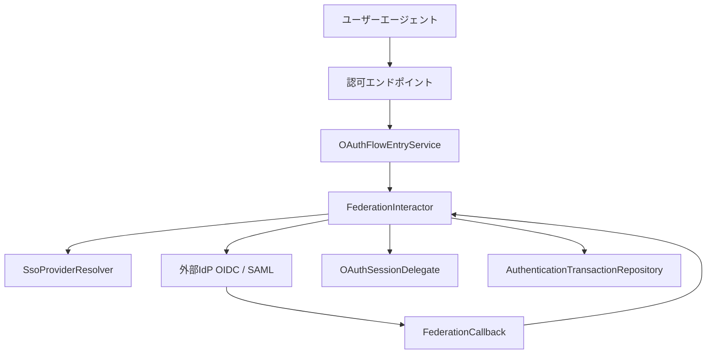

# フェデレーション

## 1. 概要

`idp-server` の **フェデレーションアーキテクチャ** は、以下のような標準プロトコルを使って外部のアイデンティティプロバイダ（IdP）と連携するための仕組みを提供します：

- OpenID Connect (OIDC)
- SAML 2.0（対応予定）

このアーキテクチャは **プラガブルかつ拡張可能**
な設計になっており、テナントごとに異なるフェデレーションログインフローをサポートしつつ、認可処理のコアからフェデレーションロジックを分離しています。

## 2. ユースケース

- Google Workspace や Azure AD などのエンタープライズSSO
- マイナンバーなどの国家デジタルIDを用いた市民ログイン
- 学術フェデレーション（例：学認、eduGAIN）
- マルチテナントSaaSにおける BYOIdP（Bring Your Own IdP）

## 3. アーキテクチャ概要

## 4. フロー概要

1. **開始**  
   `POST /{id}/federations/{type}/{provider}`  
   → `OAuthFlowEntryService.requestFederation(...)` を呼び出す

2. **外部IdPへリダイレクト**  
   → `SsoProviderResolver` によるプロバイダー固有のメタデータを使って構築

3. **コールバック処理**  
   → `FederationInteractor.callback(...)` によりレスポンスを検証し、ユーザーコンテキストを構築

4. **ユーザーセッションのリンク**  
   → 認証が成功すればセッションと `AuthenticationTransaction` を更新

5. **認可処理に続く**  
   → フェデレーションIDも他の認証結果と同様に扱われる

## 5. 拡張性

フェデレーションは **戦略ベース（Strategy Pattern）** で実装されています：

- 各 `FederationType`（例：OIDC、SAML）はそれぞれ独自の `FederationInteractor` を持つ
- 外部IdPのメタデータは `SsoProvider` により動的にロード
- テナントごとのルーティングやプロトコル挙動も柔軟に切り替え可能

拡張例：

- 新しいフェデレーションタイプ（例：ウォレットログイン）の追加
- クレームマッピングや NameID フォーマットのカスタマイズ
- ユーザー識別や属性変換のカスタムロジックを注入

## 6. 将来的な対応予定

- ✅ OIDC フェデレーション（すでに対応済）
- 🔜 SAML 2.0 フェデレーション（OpenSAML などで対応予定）
- 🔜 分散型ID（DID / VCベースのログイン）
- 🔒 フェデレーショントラストチェーンの検証機能
