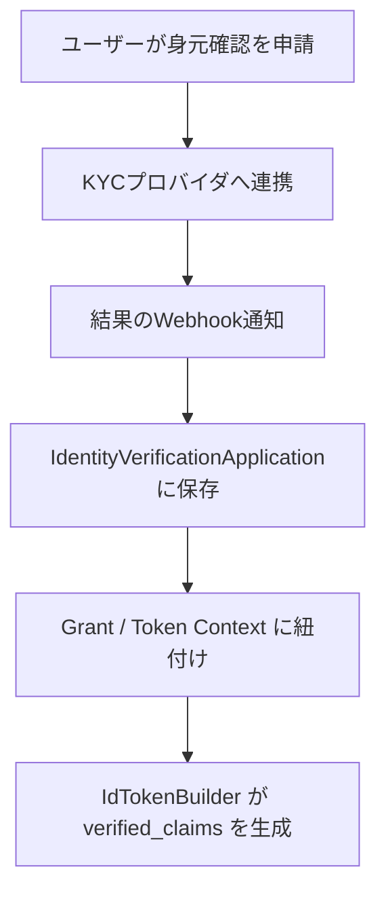

# 身元確認 (OIDC4IDA)

## 1. 概要

Identity Verification（身元確認）は、高い信頼度が求められる認証システムにおいて重要な要素です。公的書類や顔認証などの信頼性の高い手段を用いて、本人が実在することを確認します。

OpenID Connect のコンテキストでは、身元確認の結果は `verified_claims` フィールドを通じて ID トークンで連携され、OIDC for
Identity Assurance（OIDC4IDA）仕様に従います。

この仕組みは、以下の分野でよく使われています：

* 🏦 金融サービス（口座開設、融資など）
* 📱 通信事業者（SIM登録など）
* 🏛 行政サービス（マイナンバー、電子証明書）
* 💼 雇用・教育でのオンボーディング

### Identity Verification の目的

* 🔐 デジタルIDの信頼性を確保
* ⚖️ 法的・規制要件（AML/CFT、FATF、eIDAS等）への対応
* 📄 公的書類（パスポート、IDカード）の検証
* 🔄 検証済み属性のポータビリティ（eKYC再利用）

---

## 2. eKYC連携のポイント

* `identity_verification_application` にて申請状態・結果を管理
* テナントごとに信頼フレームワークや証拠形式を事前合意（例：`de_aml`, `jp_my_number`）
* 同期／非同期のAPI・Webhook連携に対応
* Webhookの結果には以下を含む：

    * 証拠タイプ（例：`id_document`, `utility_bill`）
    * 検証手段（`pipp`, `sripp`, `face-to-face`）
    * 信頼スコア、検証日時

```json
{
  "type": "id_document",
  "method": "sripp",
  "document": {
    "type": "passport",
    "issuer": "JP"
  },
  "time": "2025-04-01T11:00:00Z"
}
```

---

## 3. `verified_claims` の構造

```json
{
  "verified_claims": {
    "verification": {
      "trust_framework": "de_aml",
      "time": "2025-04-01T12:00:00Z",
      "evidence": [
        {
          "type": "id_document",
          "method": "pipp",
          "time": "2025-04-01T11:00:00Z"
        }
      ]
    },
    "claims": {
      "given_name": "Taro",
      "family_name": "Yamada",
      "birthdate": "1990-01-01"
    }
  }
}
```

| フィールド名            | 説明                   |
|-------------------|----------------------|
| `trust_framework` | eIDASなどの法制度・信頼枠組みを示す |
| `evidence`        | 使用された身元確認証拠一覧        |
| `claims`          | 検証済みの属性（氏名、生年月日など）   |

---

## 4. フロー（Mermaid）



---

## 5. 実装のポイント

* `IdentityVerificationApplication` にて身元確認状態を管理
* グラントに検証結果メタデータを保存
* `IdTokenBuilder` にて条件に応じて `verified_claims` を出力
* テナント単位で `trust_framework`, `evidence` のカスタマイズが可能
* 同期・非同期API両方に対応

---

## 6. ユースケース

* eKYCによる身元確認
* 金融機関でのAML対応
* 公的IDとの連携
* 雇用／教育の資格証明

信頼性・柔軟性・拡張性を両立しつつ、各種の身元確認エコシステムとの相互運用が可能になります。
