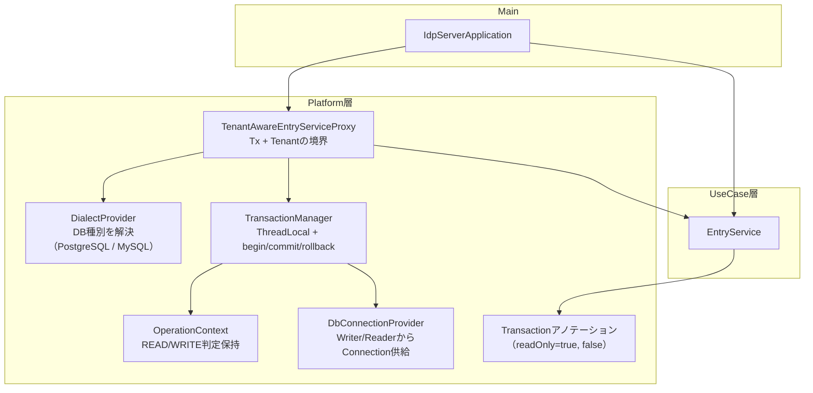

# マルチデータソースアーキテクチャ

## 概要

`idp-server` は、マルチテナント + マルチデータベース環境に最適化された、明示的制御による柔軟なデータソース管理アーキテクチャを採用しています。

`Spring` などのFWに頼らず、トランザクションをProxy経由で明確に制御することで、OSSとしての拡張性・ポータビリティを高めています。

ここでは、マルチデータソース構成の全体像と、それを支える各コンポーネントの責務について説明します。また、`Spring` との比較も記載します。

## アーキテクチャ

- IdpServerApplicationは、Proxy経由でユースケースのEntryServiceクラスのインスタンスを生成します。
- DbConnectionProviderは、Writer/Readerを保持してDB接続情報を供給します。
- DialectProvider は、このテナントのデータベース設定を解決します。
- OperationContext が「読取りか書き込みか」を明示 → HikariConnectionProvider が適切な DataSource を選ぶ
- TransactionManager が ThreadLocal<Connection>ベースにコネクションとトランザクションを制御
- TenantAwareEntryServiceProxy が処理フローを制御する。SpringでいうAOP + Contextの役割
- EntryServiceは機能の実行を行う

## Spring との比較

| 機能カテゴリ                | Spring Framework                                        | idp-server                                                                |
|-----------------------|---------------------------------------------------------|---------------------------------------------------------------------------|
| **AOPによる横断処理**        | `@Transactional` → AOP                                  | `TenantAwareEntryServiceProxy`（JDK Proxy + `invoke()`）で制御                 |
| **Txの開始/終了**          | `PlatformTransactionManager`が制御                         | `TransactionManager`が　`begin/commit/rollback` を制御                         |
| **データソースの選択**         | ルーティングを独自実装する必要あり                                       | `DialectProvider.provide(tenantId)` による分岐                                 |
| **DataSourceContext** | `ThreadLocal`: `RoutingContextHolder`                   | `TransactionManager`が　`OperationContext`と `DbConnectionProvider` を利用し解決する |
| **Writer/Reader分岐**   | `@Transactional(readOnly=true)` などを利用しルーティングを独自実装する必要あり | `@Transaction(readOnly = true)` で自動制御                                     |
