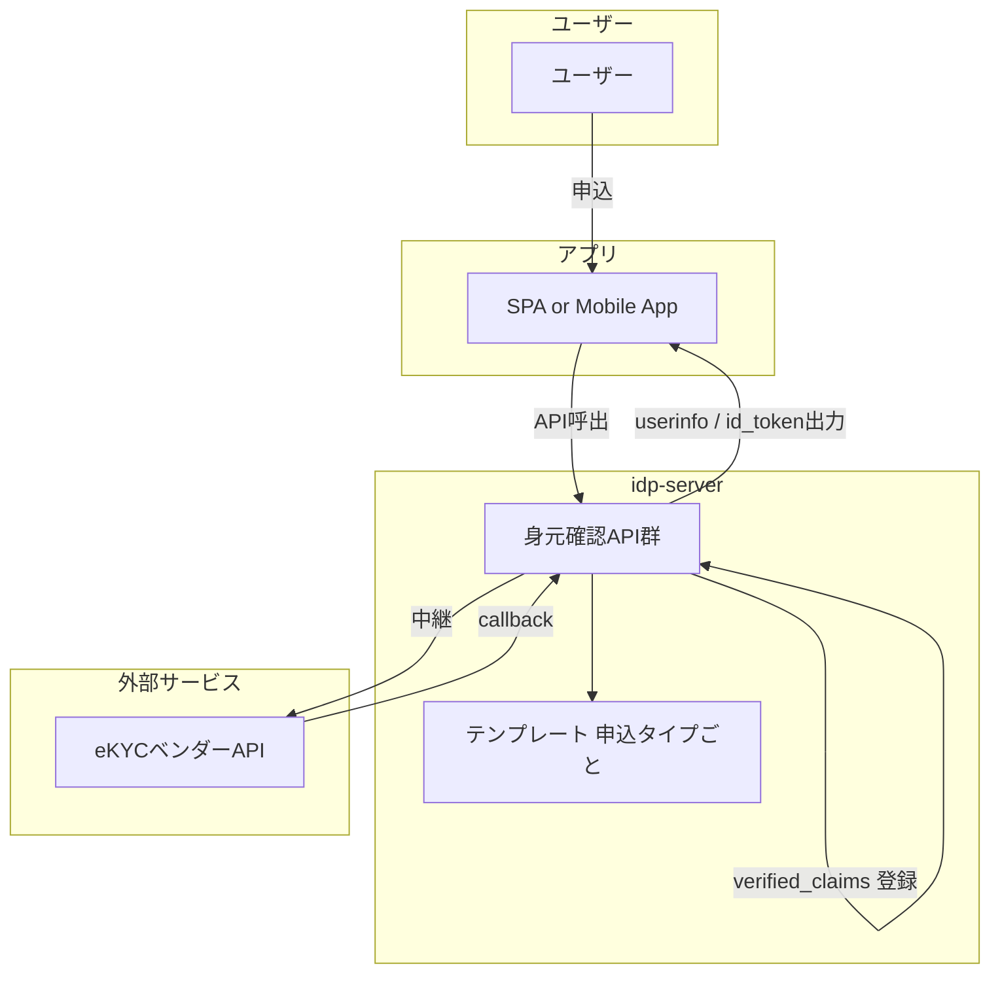

# 身元確認申込み 導入ガイド

## 🎯 このガイドの目的

このガイドは、`idp-server` の身元確認申込み（identity verification application）機能の実装・設定・デバッグに関わる開発者が、
**最短で「全体像」と「実装ポイント」を把握**し、迷わず開発に着手できるようにすることを目的とする。

---

## ✅ まず最初に知るべきこと（5つ）

| 観点                          | 一言で                                                                                      |
|-----------------------------|------------------------------------------------------------------------------------------|
| 1. **テンプレート駆動設計**           | 申込ロジックはテンプレート（JSON）に書いて制御される。コードは書かない。                                                   |
| 2. **7つのフェーズ**              | request / pre_hook / execution / post_hook / transition / store / response という処理フェーズがある。 |
| 3. **APIは動的生成**             | `/v1/me/identity-verification/applications/{type}/{process}` のパスはテンプレートに応じて変わる。          |
| 4. **verified_claimsは自動生成** | eKYC結果に応じてIDトークンなどにverified_claimsが出力される。                                                |
| 5. **実装は「Mappingとの戦い」**     | 全ての処理は `mapping_rules` と `transition条件` の設定がキモになる。                                       |

---

## 🏗️ 最低限把握しておく構成図



---

## 💡 最初に触るべきファイル

| ファイル名                                                                                             | 役割         | 目的                             |
|---------------------------------------------------------------------------------------------------|------------|--------------------------------|
| `E2Eテスト e2e/src/tests/scenario/application/scenario-05-identity_verification-application.test.js` | 実行テスト      | 実際の動作フローを確認。プロセスの順番やレスポンス確認に便利 |
| `設定ファイル sample-config/local/admin-tenant/identity/investment-account-opening.json`                | 身元確認テンプレート | 身元確認の流れ・パラメータ・ルール全部ここに書く       |

---

## 🚦 よく使う開発Tips

### ✅ テンプレート修正のリロード

```bash
curl -X PUT /v1/management/tenants/{tenant-id}/identity-verification-configurations \
-H "Authorization: Bearer ${ACCESS_TOKEN}" \
-H "Content-Type: application/json" \
-d @template.json
```

テンプレートを更新したら**即時反映OK（HotReload）**。

---

### ✅ ローカルログ確認のポイント

- `application_id` や `process` がログに出てる → 追いやすい
- `application_details` に外部サービス連携情報が格納される → `external_application_id` など
- Hookで失敗したら `verifications` の中身を要チェック

---

### ✅ フェーズごとのデバッグ

| フェーズ         | チェックポイント                                               |
|--------------|--------------------------------------------------------|
| `request`    | スキーマに引っかかってないか（型・required）                             |
| `pre_hook`   | externalパラメータちゃんと取れてるか（ログに `additional_parameters` 出る） |
| `execution`  | 外部API呼ばれてる？ログ or Mockoonで確認                            |
| `transition` | 条件一致してるか？ステータスが変わってる？                                  |
| `store`      | application_details に保存されとる？                           |
| `response`   | 期待した項目返ってきとる？（例：application_id）                        |

---

## 🧪 開発に入る前の「最短準備ステップ」

1. `POST /identity-verification-configurations` でテンプレートを登録
2. `POST /applications/{type}/apply` で申込APIを実行
3. `Mockoon` または手動で `callback` API を叩く
4. ステータス遷移を確認 (`GET /applications/{id}`)
5. `userinfo` or `id_token` に verified_claims が入っているか確認

---

## 📚 MappingRule の記載方法

MappingRuleは「どこから（from）」「どこへ（to）」を指定するルール。  
pre_hook、execution、store、response…あらゆる場所で出てくる超重要構成！

---

### ✅ 基本構文

```json
{
  "from": "$.request_body.email",
  "to": "user_email"
}
```

| 項目名            | 説明                                                                 |
|----------------|--------------------------------------------------------------------|
| `from`         | 取得元を [JsonPath](https://github.com/json-path/JsonPath) で指定         |
| `to`           | セット先キー名。`.`区切りでネスト可能、`*`指定でマージ展開も可能                                |
| `static_value` | 定数を使いたいときに指定（from の代わりに）                                           |
| `convert_type` | 値を変換したいときに指定。例: `"string"`, `"integer"`, `"boolean"`, `"datetime"` |

> 💡 `from` or `static_value` のどちらかは必須。両方未指定はエラーになる！

---

### 🧪 例1：リクエストからそのまま転送

```json
{
  "from": "$.request_body.given_name",
  "to": "claims.given_name"
}
```

---

### 🧪 例2：定数をセット（static_value）

```json
{
  "static_value": "jp_aml",
  "to": "verification.trust_framework"
}
```

---

### 🧪 例3：ネストされた配列要素を指定

```json
{
  "from": "$.request_body.verification.evidence[0].type",
  "to": "verification.evidence.0.type"
}
```

---

### 🧪 例4：マージして展開（`*`）

```json
{
  "from": "$.request_body",
  "to": "*"
}
```

→ request_body の中身をフラットにマージして全項目展開！

---

### 🧪 例5：型変換を指定

```json
{
  "from": "$.application.application_details.score",
  "to": "risk_score",
  "convert_type": "integer"
}
```

---

### 🧭 よく使うトップレベル参照元

| 参照元オブジェクト名              | 説明                                  |
|-------------------------|-------------------------------------|
| `request_body`          | 画面から来た申請データ                         |
| `request_attributes`    | リクエスト時のヘッダーや認証情報など                  |
| `user`                  | 現在のログインユーザーの属性情報（`sub`, `email` など） |
| `application`           | 現在進行中の申込データ（過去の入力内容）                |
| `additional_parameters` | pre_hook や post_hook で取得した値         |
| `response_body`         | executionで外部API呼んだ時の戻り値             |

---

### 🧩 Mappingが使われる代表フェーズ

| フェーズ名       | 用途                                   |
|-------------|--------------------------------------|
| `pre_hook`  | 取得した外部データの整形                         |
| `execution` | 外部APIに送るリクエストの生成                     |
| `store`     | application_details の構築              |
| `response`  | クライアントに返すレスポンス生成                     |
| `result`    | verified_claims / source_details の生成 |

---

### 📝 補足Tips

- `from` と `to` の値の型が合ってないと、実行時にクラッシュすることがある
- `convert_type` を忘れると `"123"`（文字列）→ `123`（数値）にならずにエラーになる
- `to` に `"*"` を使うとマージされるが、キー名がかぶると **後勝ち（上書き）**

## 🎁 おまけ：理解度チェック

- [ ] `processes` に定義される7フェーズをすぐ言える？
- [ ] `from` → `to` のマッピングルール書ける？
- [ ] テンプレート更新時のHotReload方法わかる？
- [ ] `callback-result` で verified_claims に繋がる条件わかる？
- [ ] ステータス `applying` → `examination_processing` → `approved` の流れわかる？
