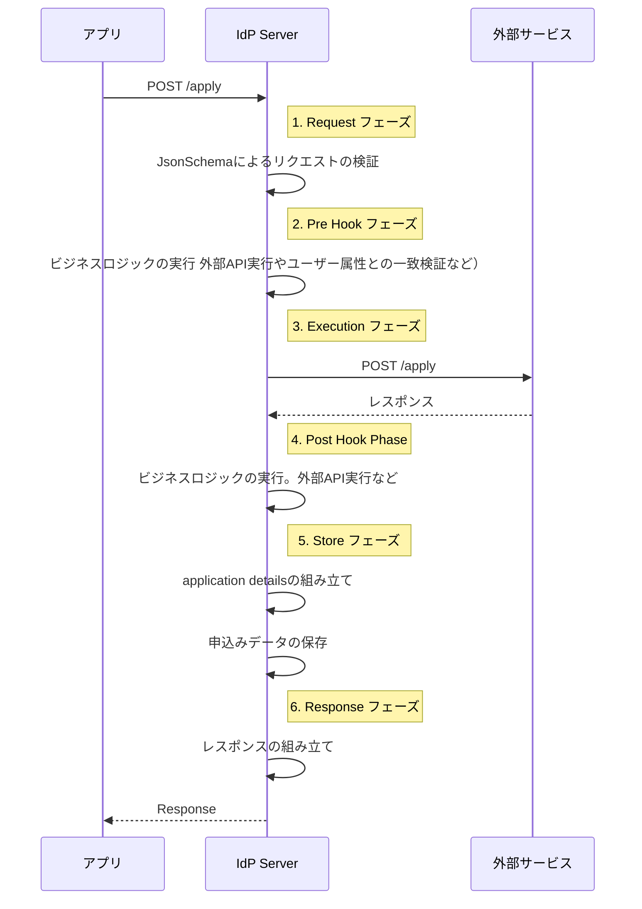
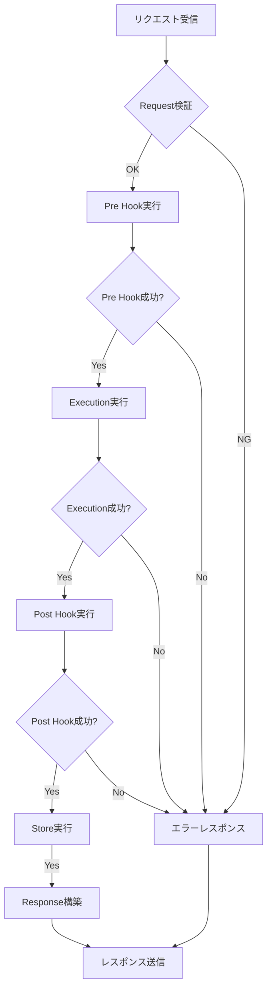

# 身元確認申込みの詳細設定ガイド

## 概要

`idp-server` は身元確認済みID（verified ID）を提供するにあたり、外部のサービスと連携した **申込み・審査・完了登録**
の一連の申込みを管理できます。

この機能を利用することで、ユーザーから収集した情報を外部の身元確認サービスに送信し、確認済みクレーム（`verified_claims`）として
`idp-server` に反映できます。

外部サービスとの連携はテンプレート形式で柔軟に定義可能であり、JSON Schema による構造化と検証、そしてマッピングルールによる変換に対応しています。

## 利用方法

1. `Control Plane API` を使ってテンプレートを事前に登録する（テンプレートIDで管理）。
2. ユーザーが申込み操作を実行すると、定義済みテンプレートに従って申込み処理を実行する。
3. 外部サービスからコールバックも同様に、定義済みテンプレートに従って処理を実行する。
4. 身元確認が完了すると `verified_claims` をユーザーに紐づけて永続化する。
5. IDトークンやUserInfoに `verified_claims` を含めることができる。

## 設定項目（テンプレート定義）

| 項目          | 内容                                          | 必須 |
|-------------|---------------------------------------------|----|
| `id`        | テンプレートのUUID                                 | ✅️ |
| `type`      | 申込み種別（例: `investment-account-opening`）      | ✅️ |
| `common`    | 共通設定                                        | -  |
| `processes` | 申込みプロセス。一連の身元確認のプロセスを定義する。複数登録可能            | ✅️ |
| `result`    | `verified_claims` `source_details` のマッピング定義 | -  |

## 申込APIのパスの動的設定

身元確認申込みAPIは、テンプレートのprocesses定義の基づいて、テナント単位で動的にルーティングされる仕組みになっています。

APIのパスの verification-type と process が、テンプレートの "type" フィールドと "processes"
に定義されたキーにより組み立てられます。

※テナント間で設定は共有されません。ただし、別テナントに同一の設定を適用するこは可能。

ベースPath

```
初回申込み
POST /{tenant-id}/v1/me/identity-verification/applications/{verification-type}/{process}

後続処理
POST /{tenant-id}/v1/me/identity-verification/applications/{verification-type}/{id}/{process}
```

### 例

```json
{
  "type": "investment-account-opening",
  "processes": {
    "apply": {},
    "ekyc-request": {}
  }
}
```

この定義の場合

```
POST /{tenant-id}/v1/me/identity-verification/applications/investment-account-opening/apply
POST /{tenant-id}/v1/me/identity-verification/applications/investment-account-opening/{id}/ekyc-request
```

### `process` に定義できる処理タイプ例

- `apply`：申請データの送信
- `request-ekyc`：eKYC用URL取得
- `complete-ekyc`：完了通知
- `callback-examination`：審査状態の通知（コールバック）
- `callback-result`：verified_claims 登録用データの受信（コールバック）

### ポイント

- "type" は API の verification-type に対応
- "processes" の各キー名が process に対応
- APIリクエストを受けると、該当テンプレートとプロセス定義を読み取り、動的に外部API連携や申請処理を行う

---

## process詳細

身元確認申込みAPIの内部ロジックは、6つの主要なフェーズで構成されています。

これらのフェーズにより、柔軟で拡張可能な申込み処理を実現しています。

### 6つのフェーズ

| フェーズ名            | 役割・目的                      | 主な設定項目                                                    | 必須 |
|------------------|----------------------------|-----------------------------------------------------------|----|
| **1. request**   | リクエストの構造・形式を検証             | `schema`（JSON Schema）                                     | -  |
| **2. pre_hook**  | 実行前の事前検証・外部パラメータ取得・外部API実行 | `verifications`, `additional_parameters`                  | -  |
| **3. execution** | メイン業務処理（外部連携 or 内部処理）      | `type`, `http_request`, `mock`, `no_action` など（処理タイプに応じて） | ✅  |
| **4. post_hook** | 実行後の検証・外部API実行             | `verifications` `additional_parameters`                   | -  |
| **5. store**     | 処理結果や申請内容の永続化              | `application_details_mapping_rules`                       | -  |
| **6. response**  | クライアントへのレスポンス生成            | `body_mapping_rules`                                      | -  |

### プロセス処理シーケンス図



### 詳細処理フロー



## 各フェーズの詳細設定

### 1. Request フェーズ

**目的**: リクエストの受信と基本検証

**主な機能**:

- リクエストスキーマ検証
    - 必須パラメータチェック
    - データ型・形式検証
- 認証情報確認

**設定例**:

```json
{
  "request": {
    "schema": {
      "type": "object",
      "required": [
        "last_name",
        "first_name",
        "email_address"
      ],
      "properties": {
        "last_name": {
          "type": "string",
          "maxLength": 255
        },
        "email_address": {
          "type": "string",
          "pattern": "^[\\w\\.-]+@[\\w\\.-]+\\.[a-zA-Z]{2,}$"
        }
      }
    }
  }
}
```

**処理内容**:

1. リクエストボディのJSONスキーマ検証
2. 必須フィールドの存在確認
3. データ形式の妥当性チェック
4. 文字数制限などの制約確認

**設定項目**:

| 項目名           | 型         | 説明                                                      |
|---------------|-----------|---------------------------------------------------------|
| `type`        | string    | 基本は `"object"`。ルートのデータ型を定義。                             |
| `required`    | string\[] | 必須項目名のリスト。リクエストにこの項目が存在しないとエラーになる。                      |
| `properties`  | object    | 各プロパティのバリデーション定義を含むオブジェクト。                              |
| └ `<key>`     | object    | 各プロパティに対する制約（型、長さ、パターンなど）。                              |
| └└`type`      | string    | `"string"`, `"integer"`, `"boolean"`, `"object"` などを指定。 |
| └└`format`    | string    | `"date"`, `"date-time"` など、特定フォーマットの検証に使用。              |
| └└`pattern`   | string    | 正規表現による文字列パターンチェック。例: メールアドレス。                          |
| └└`minLength` | integer   | 文字列の最小文字数。                                              |
| └└`maxLength` | integer   | 文字列の最大文字数。                                              |
| └└`minimum`   | integer   | 数値の最小値。                                                 |
| └└`maximum`   | integer   | 数値の最大値。                                                 |

---

### 2. Pre Hook フェーズ

**目的**: メイン処理実行前の準備・検証

**主な機能**:

- 申込みに対するビジネスロジック検証（複数指定できる。設定順に実行する）
    - ユーザークレームの検証
    - 重複申込み検証
    - その他のロジックも追加予定
- 追加パラメータ取得（複数指定できる。設定順に実行する）
    - 外部API実行
    - その他のロジックも追加予定

**設定例**:

```json
{
  "pre_hook": {
    "verifications": [],
    "additional_parameters": []
  }
}
```

**処理内容**:

1. 申込みに対するビジネスロジック検証
2. 追加パラメータ取得

の順で実行される。

#### verifications: ビジネス検証処理群

申請前に確認すべきチェック（例：ユーザー情報との一致、重複申請、外部ブラックリスト照会など）を定義する。

```json
{
  "type": "user_claim",
  "details": {}
}

```

**type 一覧**

| type                          | 概要                     |
|-------------------------------|------------------------|
| `user_claim`                  | リクエスト内容とユーザークレームの一致確認。 |
| `application_limitation` （予定） | 申込み可能数チェック。            |
| `duplicate_application` （予定）  | 過去の申請と重複がないかをチェック。     |
| `http_request`（予定）            | 外部APIと連携して検証を行う。       |

**user_claim の詳細構造**

```json
{
  "type": "user_claim",
  "details": {
    "verification_parameters": [
      {
        "request_json_path": "$.request_body.phone_number",
        "user_claim_json_path": "phone_number"
      },
      {
        "request_json_path": "$.request_body.email",
        "user_claim_json_path": "email"
      }
    ]
  }
}
```

| フィールド                  | 型      | 説明                        |
|------------------------|--------|---------------------------|
| `request_json_path`    | string | リクエストから値を取得するJSONPath     |
| `user_claim_json_path` | string | ユーザークレームから値を取得するキー（ネスト対応） |

#### additional_parameters: 動的パラメータ取得

申込みに必要な情報を外部や他ソースから事前に取得する機構。

```json
{
  "type": "http_request",
  "details": {}
}

```

| type           | 説明                    |
|----------------|-----------------------|
| `http_request` | 外部APIを叩いて追加パラメータを取得する |

```json
{
  "type": "http_request",
  "details": {
    "url": "http://localhost:5000/{{external_application_id}}/resolve",
    "method": "POST",
    "path_mapping_rules": [
      {
        "from": "$.application.application_details.external_application_id",
        "to": "external_application_id"
      }
    ],
    "header_mapping_rules": [
      {
        "from": "$.request_attributes.headers.token",
        "to": "x-token"
      }
    ],
    "body_mapping_rules": [
      {
        "from": "$.request_body",
        "to": "*"
      }
    ],
    "parameterNames": {
      "status_code": "resolve_status_code",
      "header": "resolve_header",
      "body": "resolve_body"
    }
  }
}

```

##### http_requestの設定

| JSONキー名                | 型               | 説明                                                        | 必須 |
|------------------------|-----------------|-----------------------------------------------------------|----|
| `url`                  | `string`        | ベースとなるリクエストURL（例：`https://example.com/users/{{user_id}}`） | ✅  |
| `method`               | `string`        | HTTPメソッド（例：`GET`, `POST` など）                              | ✅  |
| `auth_type`            | `string`        | 認証方式（`none`, `oauth2`, `hmac_sha256`）                     | ✅  |
| `oauth_authorization`  | `object`        | OAuth2認証の設定（`auth_type = "oauth2"` のときに必要）                | △  |
| `hmac_authentication`  | `object`        | HMAC認証の設定（`auth_type = "hmac_sha256"` のときに必要）             | △  |
| `path_mapping_rules`   | `array<object>` | URLパスのマッピングルール一覧                                          | -  |
| `header_mapping_rules` | `array<object>` | リクエストヘッダーのマッピングルール一覧                                      | -  |
| `body_mapping_rules`   | `array<object>` | リクエストボディのマッピングルール一覧                                       | -  |
| `query_mapping_rules`  | `array<object>` | GETメソッド用のクエリパラメータマッピングルール一覧                               | -  |

凡例：

- ✅：常に必須
- △：条件付き必須（auth_type による）
- -：任意

**mapping_rules 配列内のルール構造**

| フィールド          | 型        | 説明                                                                                    | 必須    |
|----------------|----------|---------------------------------------------------------------------------------------|-------|
| `from`         | `string` | 抽出元（JSONPath）例: `$.request_body.customer_id`                                          | △（※1） |
| `to`           | `string` | 変換先キー（例: `resolved.customer_id`, `*`）`.`形式でオブジェクトのネストが可能。`※`を指定するとトップ階層にオブジェクトが展開される。 | ✅     |
| `static_value` | `any`    | 静的な値（JSONPathを使わず固定値を設定したい場合に使用）                                                      | △（※1） |
| `convert_type` | `string` | 省略可。型変換が必要な場合に指定（`string`, `int`, `boolean`, `datetime`）                              | -     |

補足

- ※1：「from」or「static_value」のどちらか一方は必須
- 両方が未指定の場合、無効なマッピングルールとして扱われる

**mapping_rules fromの指定方法**

from で参照できるトップレベルのオブジェクトは以下の通り：

| オブジェクト名              | 内容                                |
|----------------------|-----------------------------------|
| `request_body`       | ユーザーからの申請リクエストボディ（画面入力値など）        |
| `request_attributes` | 認証情報やHTTPリクエストヘッダー等のリクエスト属性       |
| `user`               | ユーザー情報（`sub`, `email`, `name` など） |
| `application`        | 現在の申込み情報                          |

**注意点**

- JSONPathのプレフィックス $ は 省略不可
- オブジェクトが存在しない場合、値は null となる
- from または static_value はいずれか 必須（両方未指定はエラー）
- to に "*" を使うと、指定したオブジェクトの中身をトップ階層に展開できる（競合時の挙動には注意）

---

### 3. Execution フェーズ

**目的**: メインとなるビジネスロジックの実行

**機能**:

- 外部API呼び出し
- 何もしない
- Mock（予定）
- 内部ロジック実行（予定）

**外部API呼び出しの設定例**:

```json
{
  "execution": {
    "type": "http_request",
    "http_request": {
      "url": "http://localhost:5000/{{external_application_id}}/process",
      "method": "POST",
      "auth_type": "oauth2",
      "oauth_authorization": {
        "type": "password",
        "token_endpoint": "http://localhost:5000/token",
        "client_id": "your-client-id",
        "username": "username",
        "password": "password",
        "scope": "application"
      },
      "static_headers": {
        "Content-Type": "application/json",
        "Authorization": "Bearer dummy-token"
      },
      "path_mapping_rules": [
        {
          "from": "$.application.application_details.external_application_id",
          "to": "external_application_id"
        }
      ],
      "body_mapping_rules": [
        {
          "from": "$.request_body.trust_framework",
          "to": "trust_framework"
        },
        {
          "from": "$.request_body.evidence_document_type",
          "to": "evidence_document_type"
        },
        {
          "from": "$.additional_parameters.resolve_body",
          "to": "*"
        }
      ]
    }
  }
}
```

**外部API呼び出しの処理内容**:

1. OAuthによるアクセストークンの取得(必要な場合)
2. URLパラメータの動的置換(必要な場合)
3. リクエストボディのマッピング・変換(必要な場合)
4. 外部APIへのHTTPリクエスト送信

**mapping_rules fromの指定方法**

from で参照できるトップレベルのオブジェクトは以下の通り：

| オブジェクト名                 | 内容                                |
|-------------------------|-----------------------------------|
| `request_body`          | ユーザーからの申請リクエストボディ（画面入力値など）        |
| `request_attributes`    | 認証情報やHTTPリクエストヘッダー等のリクエスト属性       |
| `user`                  | ユーザー情報（`sub`, `email`, `name` など） |
| `application`           | 現在の申込み情報                          |
| `additional_parameters` | pre_hookで追加したパラメータ                |

---

### 4. Post Hook フェーズ

**目的**: メイン処理後の結果検証・変換

**主な機能**:

- 外部API呼び出し

**設定例**:

```json
{
  "post_hook": {
    "transformations": [
      {
        "type": "data_validation",
        "rules": [
          {
            "path": "$.response_body.status",
            "expected": "success"
          }
        ]
      },
      {
        "type": "data_mapping",
        "mapping_rules": [
          {
            "from": "$.response_body.external_id",
            "to": "application_id"
          }
        ]
      }
    ]
  }
}
```

**処理内容**:

1. 実行結果の妥当性検証
2. レスポンスデータの変換・正規化
3. 次のフェーズに向けたデータ準備
4. エラー状態の検知・処理

**mapping_rules fromの指定方法**

from で参照できるトップレベルのオブジェクトは以下の通り：

| オブジェクト名                 | 内容                                    |
|-------------------------|---------------------------------------|
| `request_body`          | ユーザーからの申請リクエストボディ（画面入力値など）            |
| `request_attributes`    | 認証情報やHTTPリクエストヘッダー等のリクエスト属性           |
| `user`                  | ユーザー情報（`sub`, `email`, `name` など）     |
| `application`           | 現在の申込み情報                              |
| `additional_parameters` | pre_hookで追加したパラメータ                    |
| `response_status_code`  | executionで外部APIを利用した際のレスポンスのステータスコード。 |
| `response_headers`      | executionで外部APIを利用した際のレスポンスヘッダー。      |
| `response_body`         | executionで外部APIを利用した場合のレスポンスのボディー。    |

---

### 5. Store フェーズ

**目的**: 処理結果の永続化

**主な機能**:

- 申込みの詳細として保存する対象のマッピング

**設定例**:

```json
{
  "store": {
    "application_details_mapping_rules": [
      {
        "from": "$.request_body",
        "to": "*"
      },
      {
        "from": "$.response_body.application_id",
        "to": "application_id"
      },
      {
        "from": "$.response_body.application_id",
        "to": "external_application_id"
      },
      {
        "from": "$.response_body.status",
        "to": "process_status"
      },
      {
        "from": "$.request_attributes.headers",
        "to": "*"
      }
    ]
  }
}
```

**処理内容**:

1. リクエストデータの保存
2. レスポンスデータの保存

**mapping_rules fromの指定方法**

from で参照できるトップレベルのオブジェクトは以下の通り：

| オブジェクト名                 | 内容                                    |
|-------------------------|---------------------------------------|
| `request_body`          | ユーザーからの申請リクエストボディ（画面入力値など）            |
| `request_attributes`    | 認証情報やHTTPリクエストヘッダー等のリクエスト属性           |
| `user`                  | ユーザー情報（`sub`, `email`, `name` など）     |
| `application`           | 現在の申込み情報                              |
| `additional_parameters` | pre_hook・post_hookで追加したパラメータ          |
| `response_status_code`  | executionで外部APIを利用した際のレスポンスのステータスコード。 |
| `response_headers`      | executionで外部APIを利用した際のレスポンスヘッダー。      |
| `response_body`         | executionで外部APIを利用した場合のレスポンスのボディー。    |

---

### 6. Response フェーズ

**目的**: クライアントへのレスポンス構築

**主な機能**:

- レスポンスデータ構築

**設定例**:

```json
{
  "response": {
    "body_mapping_rules": [
      {
        "from": "$.response_body.application_id",
        "to": "application_id"
      },
      {
        "from": "$.response_body.status",
        "to": "status"
      },
      {
        "from": "$.response_body.message",
        "to": "message"
      }
    ]
  }
}
```

**処理内容**:

1. 必要なデータのマッピング

**mapping_rules fromの指定方法**

from で参照できるトップレベルのオブジェクトは以下の通り：

| オブジェクト名                 | 内容                                    |
|-------------------------|---------------------------------------|
| `request_body`          | ユーザーからの申請リクエストボディ（画面入力値など）            |
| `request_attributes`    | 認証情報やHTTPリクエストヘッダー等のリクエスト属性           |
| `user`                  | ユーザー情報（`sub`, `email`, `name` など）     |
| `application`           | 現在の申込み情報                              |
| `additional_parameters` | pre_hook・post_hookで追加したパラメータ          |
| `response_status_code`  | executionで外部APIを利用した際のレスポンスのステータスコード。 |
| `response_headers`      | executionで外部APIを利用した際のレスポンスヘッダー。      |
| `response_body`         | executionで外部APIを利用した場合のレスポンスのボディー。    |

## 実際の設定例 - Apply プロセス

```json
{
  "apply": {
    "request": {
      "schema": {
        "type": "object",
        "required": [
          "last_name",
          "first_name",
          "email_address"
        ],
        "properties": {
          "last_name": {
            "type": "string",
            "maxLength": 255
          },
          "first_name": {
            "type": "string",
            "maxLength": 255
          },
          "email_address": {
            "type": "string",
            "pattern": "^[\\w\\.-]+@[\\w\\.-]+\\.[a-zA-Z]{2,}$"
          }
        }
      }
    },
    "pre_hook": {
      "verifications": [
        {
          "type": "user_claim",
          "details": {
            "verification_parameters": [
              {
                "request_json_path": "$.request_body.phone_number",
                "user_claim_json_path": "phone_number"
              }
            ]
          }
        }
      ]
    },
    "execution": {
      "type": "http_request",
      "http_request": {
        "url": "http://localhost:5000/apply",
        "method": "POST",
        "static_headers": {
          "Content-Type": "application/json",
          "Authorization": "Bearer dummy-token"
        },
        "body_mapping_rules": [
          {
            "from": "$.request_body",
            "to": "*"
          }
        ]
      }
    },
    "post_hook": {},
    "store": {
      "application_details_mapping_rules": [
        {
          "from": "$.request_body",
          "to": "*"
        },
        {
          "from": "$.response_body.application_id",
          "to": "application_id"
        }
      ]
    },
    "response": {
      "body_mapping_rules": [
        {
          "from": "$.response_body.application_id",
          "to": "application_id"
        },
        {
          "from": "$.response_body.status",
          "to": "status"
        }
      ]
    }
  }
}
```

## 🔧 identity_verification_result

身元確認が完了後に保存する `verified_claims`と `source_details` のマッピングルールを定義します。

### 例

```json
{
  "result": {
    "verified_claims_mapping_rules": [
      {
        "static_value": "jp_aml",
        "to": "verification.trust_framework"
      },
      {
        "from": "$.request_body.verification.evidence[0].type",
        "to": "verification.evidence.0.type"
      },
      {
        "from": "$.request_body.verification.evidence[0].check_details[0].check_method",
        "to": "verification.evidence.0.check_details.0.check_method"
      },
      {
        "from": "$.request_body.verification.evidence[0].check_details[0].organization",
        "to": "verification.evidence.0.check_details.0.organization"
      },
      {
        "from": "$.request_body.claims.given_name",
        "to": "claims.given_name"
      },
      {
        "from": "$.request_body.claims.address.postal_code",
        "to": "claims.address.postal_code"
      }
    ]
  },
  "source_details_mapping_rules": [
    {
      "from": "$.application.application_details",
      "to": "*"
    }
  ]
}
```

| オブジェクト名              | 内容                          |
|----------------------|-----------------------------|
| `request_body`       | ユーザーからの申請リクエストボディ（画面入力値など）  |
| `request_attributes` | 認証情報やHTTPリクエストヘッダー等のリクエスト属性 |
| `application`        | 申込み情報                       |

### verified_claimsスキーマの例

```json
{
  "verification": {
    "trust_framework": "idv",
    "time": "2025-06-01T00:00:00Z"
  },
  "claims": {
    "given_name": "太郎",
    "family_name": "山田",
    "birthdate": "1990-01-01",
    "email": "taro@example.com"
  }
}
```

- verified_claimsは動的なJSON構造で保存され、認証フロー内でIDトークンやuserinfoに反映。
- コールバックデータがそのまま使えない場合でも、mapping_rulesを使って構造を変換可能。
- nested arrayやobjectのマッピングにも対応。

