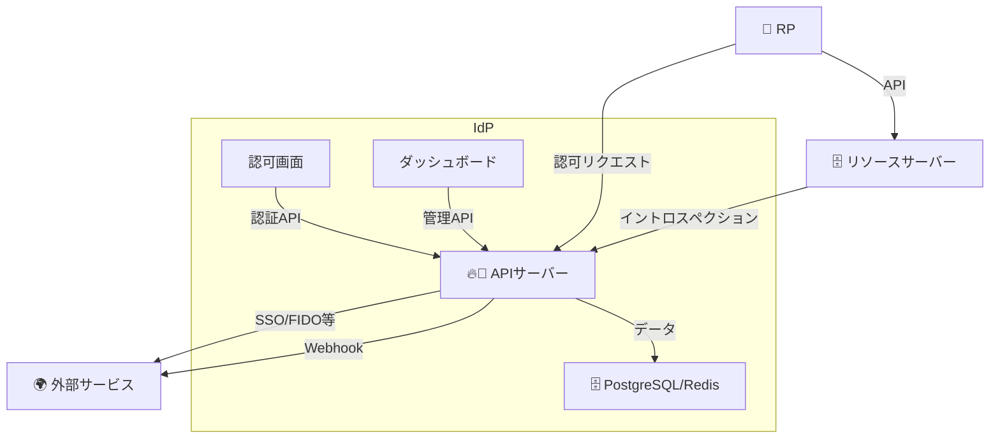

# はじめに

## `idp-server` とは？

`idp-server` は**マルチテナントを前提にした拡張可能なアイデンティティプロバイダー**です。

OAuth 2.0、OpenID Connect(OIDC)、CIBA、FAPI、そして OIDC IDA(IDA) をサポートし、今後のOAuth
OIDCの拡張仕様の追加に対応できるようにプラガブルな設計になっています。

## システム構成

本システムは、以下の主要コンポーネントからなる 認証・認可プラットフォームです。
RP（Relying Party）からの認証リクエストを受け付け、必要に応じて外部サービスやデータベースと連携することで、安全性・拡張性・運用性のバランスが取れたIdP基盤を実現します。

### 提供されるモジュール

| コンポーネント       | 説明                                                                    |
|---------------|-----------------------------------------------------------------------|
| 🔥 APIサーバー    | OAuth2/OIDC/CIBAなどのリクエスト処理。認証・認可・セッション・トークン発行を担当。FederationやFIDO2にも対応 |
| 🧍‍♂️ 認可画面    | 認証時に表示されるログインUI・同意画面などを提供。SSOやMFAにも対応                                 |
| 📊 ダッシュボード    | 管理者向けGUI。クライアント設定やテナント管理、監査ログの確認などが可能                                 |
| 🧠 DB / キャッシュ | PostgreSQLとRedisを併用し、永続データ・セッション・一時キャッシュを効率的に管理                       |

### 提供対象外（外部との連携）

| コンポーネント              | 説明                                         |
|----------------------|--------------------------------------------|
| 🎯 RP（Relying Party） | 本IdPを利用するクライアントアプリ（例: Webアプリ・ネイティブアプリなど）   |
| 🗄️ リソースサーバー         | アクセストークンを元に保護リソースを提供する外部API                |
| 🌍 外部サービス            | eKYCサービス、通知基盤（FCMなど）、Federation先IdPなどと連携可能 |

## 機能

idp-server は、OAuth 2.0 / OpenID Connect を中心に、最新の認証・認可プロトコルを柔軟にサポートするための多機能なIdPプラットフォームです。

- 標準仕様に準拠した 認証・認可処理
- ユーザー体験を高める 多様な認証方式（FIDO2 / パスワード / デバイス等）
- セキュリティ要件に応じた MFA / SSF / Federation 対応
- プラグイン可能なアーキテクチャ により、要件に応じた機能拡張が可能
- マルチテナント管理 / 通知連携 / イベントフック など、エンタープライズ対応も視野に入れた設計

このセクションでは、idp-server の各機能をモジュール単位で整理し、全体像を視覚的・構造的に把握できるようにしています。

### 機能スタック図

| モジュール               | 概要                                                                                                                                                                                                                                          |
|---------------------|---------------------------------------------------------------------------------------------------------------------------------------------------------------------------------------------------------------------------------------------|
| 🔷 **Core**         | 認証・認可の中核モジュール。OAuth 2.0 / OpenID Connect に準拠し、`Identity` や `認証ポリシー`、`認可プラグイン` などを提供                                                                                                                                                         |
| 🧩 **Core拡張機能**     | 標準仕様を補完・強化する拡張モジュール。`CIBA`, `DPoP`, `FAPI`, `FAPI2(予定)`, `PKCE`, `VC`, `IDA`, `デバイスフロー(予定)` などを提供                                                                                                                                           |
| 🔐 **認証機能**         | ユーザー認証を構成する認証手段群。`FIDO2 / Passkey`, `FIDO-UAF`, `SMS`, `Email`, `Password`, `デバイス認証`, `レガシーIDサービス連携` など                                                                                                                                     |
| 🌐 **フェデレーション機能**   | 外部IdPとのSSO連携に対応。現在は `OIDC` をサポートし、将来的に `SAML`, `LDAP` の拡張も予定                                                                                                                                                                                |
| 🔔 **通知機能**         | ユーザーへの通知を行うモジュール。`FCM`, `Email`, `SMS` による配信をサポート                                                                                                                                                                                           |
| ⚠️ **セキュリティイベント機能** | ユーザーやシステム操作に基づくイベント通知を外部に送信。`Webhook`, `Slack`, `Datadog` 連携、および `SSF` (Shared Signals Framework) に対応（Push／Pull）                                                                                                                            |
| 🧱 **Platform**     | `idp-server` 全体を支える基盤機能群。`セッション・Cookie管理`, `マルチテナンシー`, `セキュリティイベント`, `ロギング`, `トランザクション`, `DI`, `SQL`, `キャッシュ`, `証明書管理`, `CORS制御`, `通知`, `プラグインベース`, `FaaS機能` に加えて `JOSE(JWT)`, `X509`, `Random`, `UUID`, `Crypto`, `Base64` などの共通ユーティリティを統合 |

### 機能拡張について

`idp-server`は機能拡張可能なPluginのインターフェースを用意しています。

**主なPlugin**

| 分類         | 機能             | Pluginインターフェース                        | 想定されるユースケース                           |
|------------|----------------|---------------------------------------|---------------------------------------|
| 認可         | アクセストークンのプロパティ | AccessTokenCustomClaimsCreator        | 独自のプロパティをアクセストークンに付与したい場合に実装する　       |
|            | 認可リクエストの検証     | AuthorizationRequestExtensionVerifier | OAuthの拡張仕様のサポートや独自のバリデーション追加するために実装する |
| 認証         | 認証機能           | AuthenticationInteractor              | 追加の認証方式をサポートする場合に実装する                 |
| フェデレーション   | SSO            | OidcSsoExecutor                       | 標準仕様以外の拡張仕様に対応する場合に実装する               |
| セキュリティイベント | セキュリティイベントフック  | SecurityEventHookExecutor             | 標準仕様以外のフックに対応する場合に実装する                |

#### 機能拡張の手順

**idp-serverの追加開発時**

1. インターフェースを実装
2. `resources/META-INF/services` 配下にインターフェースのクラスパスのファイルを追加
   1. 例：org.idp.server.core.oidc.token.plugin.AccessTokenCustomClaimsCreator
3. 2のファイルに1で実装したクラスパスを定義
   1. 例：org.idp.server.core.extension.identity.verified.AccessTokenSelectiveVerifiedClaimsCreator

**外部モジュールによる機能拡張**

1. インターフェースを実装
2. `resources/META-INF/services` 配下にインターフェースのクラスパスのファイルを追加
   1. 例：org.idp.server.core.oidc.token.plugin.AccessTokenCustomClaimsCreator
3. 2のファイルに1で実装したクラスパスを定義
   1. 例：org.idp.server.core.extension.identity.verified.AccessTokenSelectiveVerifiedClaimsCreator
4. idp-serverの実行環境のpluginsディレクトリ配下に実装したjarを配置します。
5. idp-serverを再起動しモジュールを読み取ります。

---
