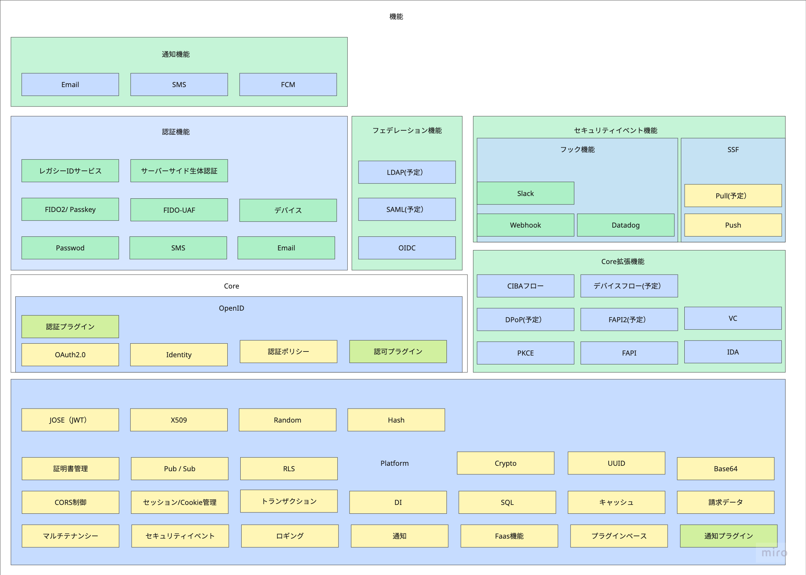

# はじめに

## `idp-server` とは？

`idp-server` は**マルチテナントを前提にした拡張可能なアイデンティティプロバイダー**です。

OAuth 2.0、OpenID Connect(OIDC)、CIBA、FAPI、そして OIDC IDA(IDA) をサポートし、今後のOAuth
OIDCの拡張仕様の追加に対応できるようにプラガブルな設計になっています。

## 機能スタック図

この図は `idp-server` の全体機能構成を示しています。

### 主な特徴

- プラグイン可能なモジュール構成
- テナントの設定に応じた機能利用

### モジュール

| モジュール         | 概要                              |
|---------------|---------------------------------|
| Platform      | idp-serverの基盤                   |
| Core          | idp-serverのコアであるOIDC機能          |
| Core拡張        | OAuth OIDCの拡張仕様を実装した機能          |
| 認証            | ユーザー認証をするための機能                  |
| フェデレーション      | 外部IDサービスとの連携をするための機能            |
| セキュリティイベントフック | ユーザーの操作のイベントをWebhookなどで外部連携する機能 |
| SSF           | OpenID標準仕様のイベント連携機能             |
| 通知            | ユーザーへの通知機能                      |

## 機能拡張について

`idp-server`は機能拡張可能なPluginのインターフェースを用意しています。

### 主なPlugin

| 分類         | 機能             | Pluginインターフェース                              | 想定されるユースケース                           |
|------------|----------------|---------------------------------------|---------------------------------------|
| 認可         | アクセストークンのプロパティ | AccessTokenCustomClaimsCreator        | 独自のプロパティをアクセストークンに付与したい場合に実装する　       |
|            | 認可リクエストの検証     | AuthorizationRequestExtensionVerifier | OAuthの拡張仕様のサポートや独自のバリデーション追加するために実装する |
| 認証         | 認証機能           | AuthenticationInteractor              | 追加の認証方式をサポートする場合に実装する                 |
| フェデレーション   | SSO            | OidcSsoExecutor                       | 標準仕様以外の拡張仕様に対応する場合に実装する               |
| セキュリティイベント | セキュリティイベントフック  | SecurityEventHookExecutor             | 標準仕様以外のフックに対応する場合に実装する                |

### 機能拡張の手順

#### idp-serverの追加開発時

1. インターフェースを実装
2. `resources/META-INF/services` 配下にインターフェースのクラスパスのファイルを追加
    1. 例：org.idp.server.core.oidc.token.plugin.AccessTokenCustomClaimsCreator
3. 2のファイルに1で実装したクラスパスを定義
    1. 例：org.idp.server.core.extension.identity.verified.AccessTokenSelectiveVerifiedClaimsCreator

#### 外部モジュールによる機能拡張

1. インターフェースを実装
2. `resources/META-INF/services` 配下にインターフェースのクラスパスのファイルを追加
    1. 例：org.idp.server.core.oidc.token.plugin.AccessTokenCustomClaimsCreator
3. 2のファイルに1で実装したクラスパスを定義
    1. 例：org.idp.server.core.extension.identity.verified.AccessTokenSelectiveVerifiedClaimsCreator
4. idp-serverの実行環境のpluginsディレクトリ配下に実装したjarを配置します。
5. idp-serverを再起動しモジュールを読み取ります。

---
