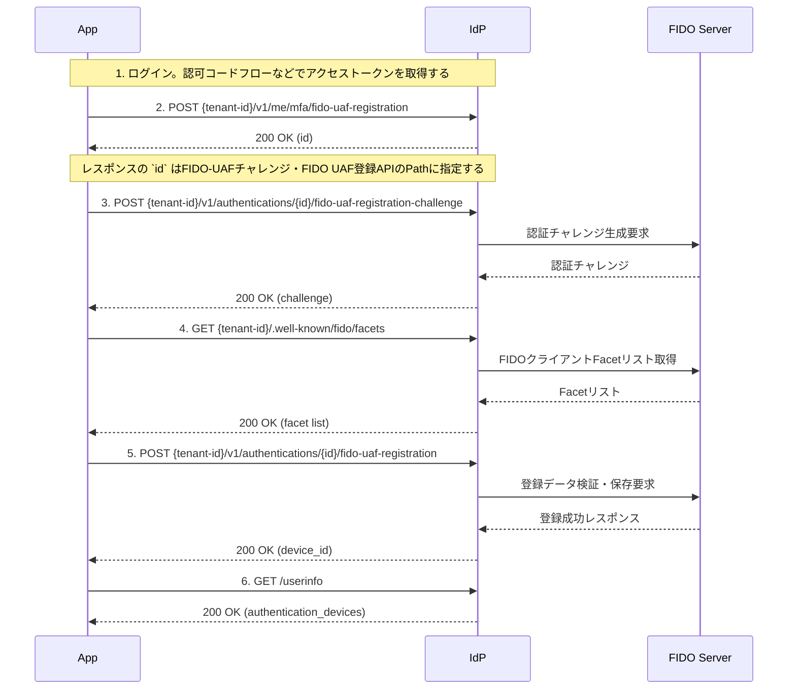

# FIDO-UAF 登録フロー

このドキュメントでは、`fido-uaf` を用いた認証デバイス登録の一連の流れを解説します。

---

## 🧭 全体の流れ

1. ログイン
2. デバイス登録リクエスト送信
3. 登録チャレンジ応答
4. FIDO-UAF Facet取得
5. デバイス登録完了
6. UserInfoで認証デバイスの登録状況を確認する

---

## 🔁 シーケンス図（Mermaid）



---

## 1. ログイン

[認可コードフロー](authorization-code-flow.md)を参照。

## 2. FIDO-UAF登録開始リクエスト

```http
POST {tenant-id}/v1/me/mfa/fido-uaf-registration
Authorization: Bearer {access_token}
Content-Type: application/json

{
  "app_name": "sampleアプリ",  
  "platform": "Android",
  "os": "Android15",
  "model": "galaxy z fold 6",
  "locale": "ja",
  "notification_channel": "fcm",
  "notification_token": "test token",
  "priority": 1
}
```

* リクエストボディ

認証デバイスの属性情報に設定するパラメータをリクエストに指定することができます。

| パラメータ名                 | 必須 | 説明                                                                                 |
|------------------------|----|------------------------------------------------------------------------------------|
| `app_name`             | -  | アプリ名（例：◯◯アプリ）。                                                                     |
| `platform`             | -  | デバイスのプラットフォーム名（例："Android", "iOS" など）。                                             |
| `os`                   | -  | オペレーティングシステムのバージョン情報（例："Android15"）。                                               |
| `model`                | -  | デバイスモデル名（例："galaxy z fold 6"）。                                                     |
| `locale`               | -  | 言語設定。（例：ja, en）                                                                    |
| `notification_channel` | -  | 通知チャネル（"fcm" など）。※現在サポートしているPush通知チャネルはfcmのみ。                                      |
| `notification_token`   | -  | 通知を送信するためのトークン（例：FCMトークン）。                                                         |
| `priority`             | -  | このデバイスの通知の優先順位（例: 1,2, 100)数値が小さいいほど優先順位が高く、1が一番優先順位が高い。省略された場合は、認証デバイスの登録数の連番となる。 |

* 正常応答レスポンス `200 OK`

```json
{
  "id": "UUID"
}
```

レスポンスの `id` はFIDO-UAFチャレンジ・FIDO UAF登録APIのPathに指定する

* 登録リクエストの検証

fido-uaf 認証デバイスの登録リクエストは、ポリシーに応じたデータの整合性を検証します。

- 登録上限数
    - 登録条件数に達していた場合、ステータスコード 400エラーを返却します。

---

## 3. FIDO-UAFチャレンジ

```http
POST {tenant-id}/v1/authentications/{id}/fido-uaf-registration-challenge

{
 FIDOサーバーのAPI仕様に沿ったパラメータを指定する
}
```

* レスポンス `200 OK`

```
{
  FIDOサーバーのAPI仕様に沿ったパラメータ
}
```

---

## 4. FIDO UAF Facet取得

```http
GET {tenant-id}/.well-known/fido/facets
```

* レスポンス `200 OK`

```
{
  FIDOサーバーのAPI仕様に沿ったパラメータ
}
```

FIDOクライアントのFacet検証に使用。

---

## 5. FIDO UAF登録

```http
POST {tenant-id}/v1/authentications/{id}/fido-uaf-registration

{
 FIDOサーバーのAPI仕様に沿ったパラメータを指定する
}
```

* レスポンス：

  ```json
  {
    "device_id": "UUID"
  }
  ```

---

## 6. UserInfoでデバイス登録を確認

FIDO-UAFクライアントは認証デバイスとして登録され、Userinfoで参照できます。

```http
GET /{tenant}/v1/userinfo
Authorization: Bearer {access_token}
```

```
{
  "sub": "user-id",
  "authentication_devices": [
    {
      "id": "UUID",
      "app_name": "sampleアプリ",  
  　　 "platform": "Android",
      "os": "Android15",
  　　 "model": "galaxy z fold 6",
      "notification_channel": "fcm",
      "notification_token": "test token",
      "available_methods": ["fido-uaf"]
      "preferred_for_notification": true
    }
  ],
  "mfa": {
    "fido-uaf": true
  }
}
```

