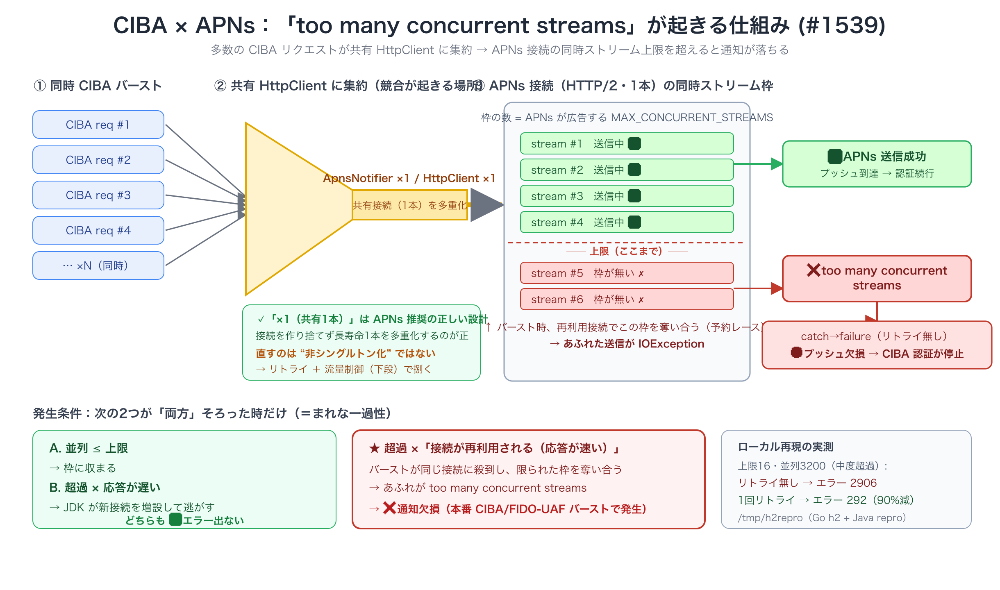

# CIBA × APNs `too many concurrent streams` 調査 (#1539)



> 図のソースは [`ciba-apns-too-many-streams.svg`](./ciba-apns-too-many-streams.svg)。再現コードは [`repro/`](./repro)。

## 結論

- バグは**実在**し、stock JDK 21 でローカル再現できる。
- 提案の **1回リトライ（#1539）は有効**（中度超過で約90%、軽度超過で約95%のエラー削減）。
- `HttpClient` を複数インスタンス化すると消えるが**力技（接続を増やすだけ）で閾値依存・APNs 推奨に逆行**。
- 構造的対策は **流量制御（Semaphore で同時送信を上限以下に絞る）**。Issue のスコープ切り（リトライを本体、並行制御は別Issue）は妥当。

## 機序

多数の CIBA リクエストが **1個の共有 `HttpClient`**（`ApnsNotifier`）に集約され、APNs 接続の**同時ストリーム上限 `MAX_CONCURRENT_STREAMS`** を超えると `IOException("too many concurrent streams")` が発生する。`ApnsNotifier#notify` の `catch (Exception)` がこれを即 `failure` にし、**リトライしない**ためプッシュが欠損する。

発生は次の **2つが両方そろった時だけ**（＝まれな一過性）:

| 条件 | 結果 |
|---|---|
| 並列 ≤ 上限 | ✅ 常に成功 |
| 超過 × 応答が遅い（接続が空かない）| ✅ JDK が新接続を増設して回避 |
| **超過 × 応答が速い（接続が再利用される）** | ❌ 再利用接続の枠を奪い合い → `too many concurrent streams` |

> 注: 上限を決めるのは**サーバー(APNs)が広告する `MAX_CONCURRENT_STREAMS`**。クライアントの `jdk.httpclient.maxstreams` は自分が広告する値（サーバープッシュ用）で送信側上限ではない。

## 実測（共有 HttpClient・ブロッキング `send()`・応答5ms）

### ① 発生条件

| サーバー上限 | 並列 | エラー | 観察 |
|---|---|---|---|
| 128 | 64（上限内） | 0 | 並列≤上限なら問題なし |
| 任意 | 100（応答3s・遅い）| 0 | 接続を100本に増設して回避 |
| 16 | 3200（中度超過）| 2906 | 再利用接続で奪い合い |

### ② 1回リトライ（100ms バックオフ）の効果

| サーバー上限 | 並列 | リトライ無 | 1回リトライ |
|---|---|---|---|
| 128 | 256（2倍超過）| 2828 | **145（95%減）** |
| 16 | 3200 | 2906 | **292（90%減）** |
| 1 | 3200（病的）| 3119 | 2457（21%減）|

### ③ HttpClient 複数インスタンス化（同負荷 64×50=3200・上限16・リトライ無）

| HttpClient数 | エラー |
|---|---|
| 1 | 2909 |
| 2 | 2197 |
| 4 | 715 |
| 8 | **0** |
| 16 | 0 |

→ 各 `HttpClient` は独立プールを持つので分散すると減る。ただし必要数は「ピーク並列 ÷ APNs上限」依存で、**バーストが伸びれば再発**。さらに `HttpClient` ごとに selector スレッド/executor/接続を抱え、APNs への接続数も増える（Apple は接続最小化＋再利用を推奨）。**力技であり構造的解決ではない**。

## 再現手順

```bash
# 1. 自己署名証明書（localhost）
openssl req -x509 -newkey rsa:2048 -keyout key.pem -out cert.pem -days 1 -nodes \
  -subj "/CN=localhost" -addext "subjectAltName=DNS:localhost"

# 2. MAX_CONCURRENT_STREAMS と応答遅延を指定して h2 サーバー起動（Go 1.24+）
DELAY_MS=5 MAX_STREAMS=16 go run repro/server.go

# 3. 別ターミナルで負荷（threads iters maxAttempts numClients）
#    例: 64スレッド×50・リトライ無(1)・クライアント1個
java repro/Repro.java 64 50 1 1
#    1回リトライ: 第3引数=2 / 複数クライアント: 第4引数=8
```

> `key.pem`（秘密鍵）と `cert.pem` は使い捨て。リポジトリにはコミットしない。
