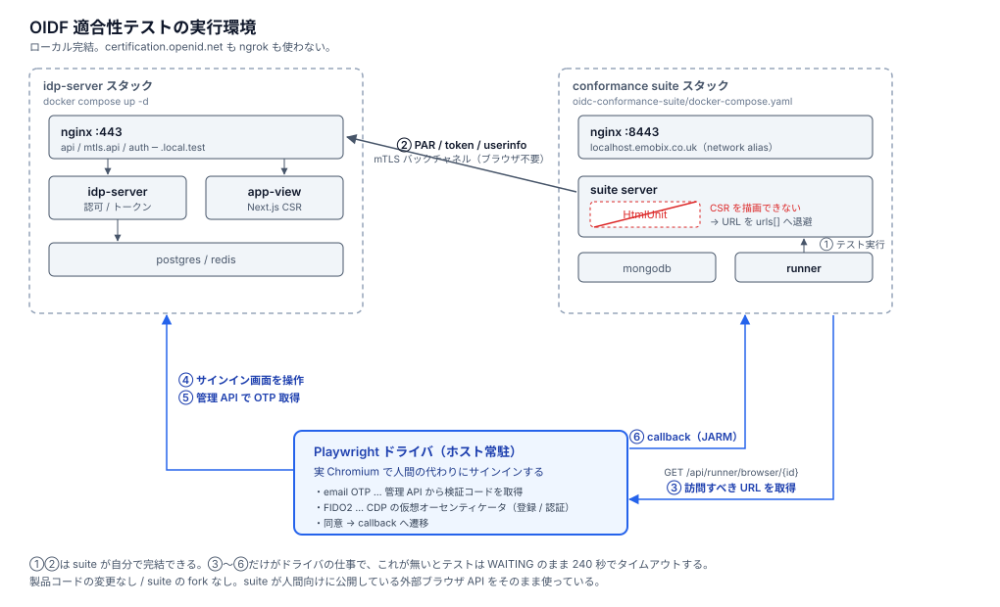

# OIDF 適合性テスト

OpenID Foundation の conformance suite をローカルで動かし、idp-server に対して適合性テストを
実行するためのハーネス。`certification.openid.net` も ngrok も使わない。

関連: [Issue #1842](https://github.com/hirokazu-kobayashi-koba-hiro/idp-server/issues/1842)



suite は PAR / token / userinfo を自分で叩けるが、**認可エンドポイントだけはブラウザが要る**。
そこが内蔵の HtmlUnit で描画できないため、その 1 工程だけをホスト常駐の Playwright ドライバが
肩代わりする（[driver/README.md](./driver/README.md)）。ドライバはサインイン URL の `tenant_id` で
対象テナントを判別するので、**スイートをまたいで 1 プロセスで足りる**。

## 対応状況

| スイート | 規格 | プラン | モジュール | 状態 |
|---|---|---|---|---|
| [fapi1-advanced](./fapi1-advanced/) | FAPI 1.0 Advanced Final | `fapi1-advanced-final-test-plan` | 63 | ✅ 58 PASSED / 3 REVIEW / 2 WARNING |
| [fapi-ciba](./fapi-ciba/) | FAPI-CIBA ID1 | `fapi-ciba-id1-test-plan` | 35 | ✅ 34 PASSED / 1 WARNING |
| [fapi2](./fapi2/) | FAPI 2.0 Security Profile Final | `fapi2-security-profile-final-test-plan` | 56 | ✅ 48 PASSED / 3 REVIEW / 4 WARNING / 1 SKIPPED |
| [oidcc](./oidcc/) | OpenID Connect Core | `oidcc-basic-certification-test-plan` | 36 | ✅ 29 PASSED / 3 REVIEW / 3 WARNING |

モジュール数は variants 適用後の実数。いずれも 2 通りの設定で流すため（FAPI 1.0 / CIBA は
`client_auth_type`、FAPI 2.0 は `sender_constrain`、OIDC Core は 2 テナント）、実行される
テストはこの倍になる。FAPI 系の結果は 1 通り目の実測、OIDC Core は 2 テナントとも同じ内訳。

**`run.sh` があるディレクトリが実行できるスイート。**

OIDC Core の Form Post OP（`oidcc-formpost-basic-certification-test-plan`）だけは配線していない。
idp-server が `response_mode=form_post` を実装しておらず、全モジュールが落ちるため
（[oidcc/README.md](./oidcc/README.md) 参照）。テナントとテスト設定は残してある。

FAILED はどのスイートにも無い。残る WARNING は 6 種類。

| 結果 | テスト | 内容 |
|---|---|---|
| WARNING | `UserInfoEndpointWithAccessTokenInBodyNotSupported` | UserInfo に access_token を POST ボディで渡す形式が未対応 |
| WARNING | `ValidateIdTokenACRClaimAgainstAcrValuesRequest` | ID Token の `acr` が要求した `acr_values` と一致しない |
| WARNING | `CheckForUnexpectedParametersInServerMetadata` | discovery の `verified_claims_supported` が suite のスキーマに登録されていない（OIDC4IDA の他のメタデータは登録済みなので登録漏れ）。idp-server 側は仕様どおり |
| WARNING | `EnsureHttpStatusCodeIs4xx` | 認可コード再利用後にアクセストークンを失効させていない。RFC 6749 §4.1.2 の SHOULD |
| WARNING | `EnsureHttpStatusCodeIs400or401` | 同じ `jti` の DPoP proof を 2 回受け付けている。`DPoPProofVerifier.java:226` に未実装と明記（RFC 9449 §4.3 は条件付き要件） |
| WARNING | `EnsureIdentityClaimsContainRequestedClaims` | `claims` パラメータで要求した属性がテストユーザーに入っていない。実装ではなくテストデータの問題 |

REVIEW は「エラーページが表示されたことを確認する」テストの正常な終着点で、失敗ではない。
FAPI 2.0 の SKIPPED 1 件はクライアント鍵が ES256 のため RS256 のテストを suite 自身が飛ばすもの。

## ディレクトリ

```
oidc-conformance-suite/
├── README.md              このファイル
├── architecture.svg       環境全体図
├── docker-compose.yaml    suite スタック（全スイート共通）
├── lib/
│   ├── runner.sh          ランナーコンテナ起動（全スイート共通）
│   └── local-ca.mjs       ローカル CA の探索（worktree からも解決できる）
├── driver/                ブラウザ操作の常駐プロセス（全スイート共用。1 プロセスでよい）
├── ciba-approver/         デバイス承認の常駐プロセス（FAPI-CIBA 用）
├── fapi1-advanced/        ← run.sh あり
├── fapi-ciba/             ← run.sh あり
├── fapi2/                 ← run.sh あり
├── oidcc/                 ← run.sh あり
└── results/               テスト結果（gitignore）
```

テスト設定 JSON はここには置かない。クライアント ID や証明書がテナント設定と対になるため、
`config/examples/<setup>/oidc-test/` に置かれている。このディレクトリはそれらを実行する
仕組みだけを持つ。

## 共通の前提

| | 用途 |
|---|---|
| Docker | idp-server / suite / テストランナーのすべて |
| Node.js | ブラウザ操作ドライバ（Playwright） |
| conformance-suite のクローン | ランナー `scripts/run-test-plan.py` を使うため |

suite 本体はビルド不要（OIDF の公開イメージを使う）が、ランナースクリプトはイメージに含まれない
ためクローンだけは要る。

```bash
git clone https://gitlab.com/openid/conformance-suite.git
export CONFORMANCE_SUITE_DIR="$PWD/conformance-suite"
```

## 共通の手順

```bash
# 1. idp-server
docker compose up -d

# 2. suite スタック
docker compose -f oidc-conformance-suite/docker-compose.yaml up -d
#    起動後 https://localhost:8443/ が開けば OK（自己署名なので警告は出る）
```

ここから先はスイートごとに違う（対象テナント、ドライバの要否、承認手順）。各ディレクトリの
README を参照。

## トラブルシュート

**suite が idp-server に到達できない**

`docker-compose.yaml` の `extra_hosts` で `api.local.test` / `mtls.api.local.test` を
`host-gateway` に向けている。idp-server 側がホストの 443 を公開していることが前提。

```bash
docker exec conformance-server curl -sk -o /dev/null -w '%{http_code}\n' \
  https://api.local.test/c3d4e5f6-a7b8-c9d0-e1f2-a3b4c5d6e7f8/.well-known/openid-configuration
```

**`localhost.emobix.co.uk` が解決できない**

公開 DNS で 127.0.0.1 に解決される前提のホスト名だが、解決できない環境がある。ドライバの API
接続は `SUITE=https://localhost:8443` で回避でき、ブラウザ側は Chromium の
`--host-resolver-rules` で固定済み。suite コンテナ内では network alias で解決される。

**redirect_uri が一致しない**

クライアント設定に登録済みの `redirect_uris` は
`https://localhost.emobix.co.uk:8443/test/a/{alias}/callback`。suite の `BASE_URL` を変えた場合は
クライアント設定側も合わせる。

## 今後

CI で回すには [#1694](https://github.com/hirokazu-kobayashi-koba-hiro/idp-server/issues/1694)
（`docker-compose.ci.yml`）が前提になる。既知の失敗を `--expected-failures-file` に登録すれば、
新規 failure だけでビルドを落とせる。
