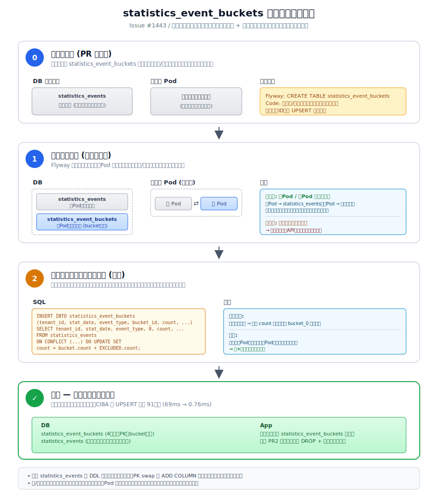

# statistics_events バケット分散 計測レポート (Issue #1443)

計測日: 2026-05-17

## 1. 改善内容

### 課題
`statistics_events` テーブルの UPSERT が、論理キー `(tenant_id, stat_date, event_type)` 単位で 1 行に集中する設計だった。
リアルタイム集計を維持しつつ高並列で書き込みが発生する状況では、PostgreSQL の行ロックで全 writer が直列化されるため、UPSERT レイテンシが極端に伸びる「ホット行コンテンション」が起きる。

### アプローチ
シャーディッドカウンター (sharded counter) パターンを、**新テーブル `statistics_event_buckets` を新設する形** で導入。

- 既存 `statistics_events` テーブルには触らず、4 カラム PK `(tenant_id, stat_date, event_type, bucket_id)` の新テーブルを作成
- 書き込み側は `ThreadLocalRandom` で `[0, N)` のバケットを抽選 → 行を N 個に分散
- 読み出し側は `SUM(count) ... GROUP BY (tenant_id, stat_date, event_type)` で再集計
- 既存データはデプロイ完了後に手動スクリプトで新テーブルへ加算マージ

→ リアルタイム集計性は維持されたまま、ホット行が N 個に分散されてロック競合が解消。**既存テーブル無変更**なので DDL ロックや旧/新コードの衝突が発生しない (詳細は §6 参照)。

主要ファイル:
- `libs/idp-server-database/postgresql/V0_10_0_1__statistics_events_bucket_distribution.sql` — `CREATE TABLE statistics_event_buckets`
- `libs/idp-server-database/mysql/V0_10_0_1__statistics_events_bucket_distribution.mysql.sql` — MySQL 版
- `libs/idp-server-database/postgresql/operation/statistics-events-bucket-migration/` — データ移行 SQL + 検証 SQL + Runbook
- `libs/idp-server-core-adapter/.../command/events/StatisticsEventBuckets.java` — バケット ID picker
- `libs/idp-server-core-adapter/.../command/events/PostgresqlExecutor.java` / `MysqlExecutor.java` — 新テーブルへ UPSERT
- `libs/idp-server-core-adapter/.../query/monthly/*.java`, `.../query/yearly/*.java` — 新テーブルから `SUM` で読み出し

## 2. 計測方法

2 段階で計測した。

### 2.1 DB 層 直接ベンチ (`bench_with_lock_observation.sh`)

PostgreSQL に直接 100 スレッド並列で UPSERT を打ち、純粋な DB レイヤの挙動を観測する。

**シナリオ**

| 項目 | 値 |
|------|----|
| writer threads | 100 (`ThreadPoolExecutor`, スレッド毎にコネクション保持) |
| ops / thread | 200 |
| total ops | 20,000 |
| ターゲット行 | 同一 `tenant_id` / `stat_date` / `event_type` のホット行 |
| バケット選択 | `random.randint(0, N-1)`（thread-local seed） |
| N (バケット数) | 1 / 32 / 128 で比較 |

**観測対象**
1. **アプリ側**: `time.monotonic()` 計測の per-op レイテンシ → avg / p50 / p95 / p99 / max / ops_sec
2. **PostgreSQL ログ**: 事前に `log_lock_waits=on` + `deadlock_timeout=50ms` を仕込んでロック待ちを `still waiting` 形式で出力 → bench 前後で `docker logs` を切り出して `grep`
3. **`pg_stat_statements`**: bench 前に `pg_stat_statements_reset()` → bench 後に UPSERT クエリだけ抽出して mean / stddev / max を取得

**整合性チェック**: bench 後に `SUM(count)` が `threads × ops` と一致するか検証 (常に OK)。

### 2.2 アプリケーション層 E2E (CIBA k6 ストレステスト)

DB 層の改善が「実トラフィック」でどこまで効くかを見るため、k6 で CIBA 系シナリオを実行。

**前提セットアップ**
- 10 テナント登録 (`register-tenants.sh`)
- 190 万ユーザー生成 (1M + 9×100K, FIDO デバイスシークレット付き)
- `statistics_enabled: true` を全テナントに付与（perf-test テンプレートで自動）
- `IDP_STATISTICS_BUCKET_COUNT` を `1` / `32` で切り替えて idp-server を再起動

**シナリオ** (`./scripts/run-stress-test.sh`)
- `scenario-2-bc` (Backchannel Authentication)
- `scenario-3-ciba-device`
- `scenario-3-ciba-phone`

**観測対象**
- k6: ops/sec、http_req_duration の avg / p50 / p95 / max、失敗率
- PostgreSQL: `pg_stat_statements` で UPSERT のみ抽出 (mean / max / stddev)

## 3. 結果

### 3.1 DB 層ベンチ

| N (buckets) | ops/sec | avg | p50 | p95 | p99 | max | UPSERT mean (pgss) | UPSERT max (pgss) |
|-------------|---------|-----|-----|-----|-----|-----|---------------------|--------------------|
| 1   |  1,212 | 78.5ms | 35.8ms | 316.9ms | 594.5ms | 1,892ms | **76.05 ms** | 1,888 ms |
| 32  |  7,031 | 11.7ms |  7.0ms |  36.4ms |  74.5ms |   257ms | **6.31 ms**  |   225 ms |
| 128 | 10,420 |  7.0ms |  5.3ms |  14.7ms |  45.0ms |   292ms | **1.54 ms**  |   149 ms |

**改善幅 (N=1 基準)**
- N=32: スループット **5.8倍**、UPSERT mean **12倍速**、p99 **8倍速**
- N=128: スループット **8.6倍**、UPSERT mean **50倍速**、p99 **13倍速**

### 3.2 CIBA k6 ストレステスト (アプリ層 E2E)

| シナリオ | N | TPS | p50 | p95 | avg | max | fail | reqs |
|----------|---|-----|-----|-----|-----|-----|------|------|
| scenario-2-bc          | 1  | 585.5 | 140.9 | 629.4 | 203.6 | 2,308 | 0.00% | 17,685 |
| scenario-2-bc          | 32 | 565.0 | 150.5 | 610.9 | 211.1 | 2,047 | 0.00% | 17,055 |
| scenario-3-ciba-device | 1  | 577.9 | 156.8 | 587.9 | 205.3 | 2,069 | 0.00% | 17,692 |
| scenario-3-ciba-device | 32 | 552.5 | 104.1 | 742.9 | 214.8 | 2,494 | 0.00% | 16,870 |
| scenario-3-ciba-phone  | 1  | 729.4 | 121.8 | 482.1 | 163.2 | 1,979 | 0.00% | 22,160 |
| scenario-3-ciba-phone  | 32 | 663.7 |  79.9 | 644.4 | 178.4 | 2,150 | 0.00% | 20,375 |

`pg_stat_statements` UPSERT 抽出 (CIBA 実行中):

| N | calls | mean (ms) | max (ms) | stddev (ms) |
|---|-------|-----------|----------|-------------|
| 1  | 39,608 | **69.16** | 2,081.18 | 119.06 |
| 32 | 39,399 | **0.76**  |   156.42 |   5.08 |

**ポイント**: DB 層の UPSERT レイテンシは **91倍速** (69ms → 0.76ms) に改善した。一方 k6 のアプリ層 TPS / p95 はほぼ変化なし、もしくは僅かに悪化する場面もある。

## 4. 考察

- **DB 層のロックコンテンションは確実に消えた**: pgss の `mean=69ms → 0.76ms` と `max=2,081ms → 156ms` は、ホット行の行ロック待ちが事実上消滅したことを示す
- **CIBA E2E では伸びない**: CIBA フローは 1 イテレーションで `bc-request → authentication → tx-result → binding-message → token` の 5 API を直列に叩く。`statistics_events` UPSERT は各 API 内で発生するが、フロー全体の支配的なコストは他に移っている可能性が高い
- **N=32 で十分**: DB 層単体でも N=32 で p99 が 75ms まで下がる。N=128 は更に伸びるが、行数 4 倍と VACUUM コストとのトレードオフ。デフォルト `IDP_STATISTICS_BUCKET_COUNT=32` で運用想定

## 5. 再現手順

> **注**: §3 の DB 層ベンチ結果は **当初検討した「既存テーブル改修」案** (`statistics_events` に直接 `bucket_id` 列を追加して PK 差し替え) で計測した。現在の採用版 (`statistics_event_buckets` 新設) では同じバケット分散原理で同等のスループット/レイテンシ特性が得られる。
>
> 再計測する場合は `performance-test/db-bench/bench_statistics_upsert.py` の対象テーブルを `statistics_event_buckets` に書き換えるか、計測用にだけ `statistics_events` に列追加 + PK 差し替えを手で行う必要がある。

```bash
# DB 層ベンチ
cd performance-test/db-bench
./bench_with_lock_observation.sh
# → results-YYYYMMDD-HHMMSS/{bench,locks,pgss}-N{1,32,128}.{txt,log}

# CIBA k6 (要テナント/ユーザー投入)
IDP_STATISTICS_BUCKET_COUNT=1  docker compose up -d --build idp-server-1 idp-server-2
./scripts/run-stress-test.sh scenario-2-bc
./scripts/run-stress-test.sh scenario-3-ciba-device
./scripts/run-stress-test.sh scenario-3-ciba-phone

IDP_STATISTICS_BUCKET_COUNT=32 docker compose up -d --build idp-server-1 idp-server-2
# 同じシナリオを再実行
```

## 6. リリース設計

### 6.1 当初検討した「既存テーブル改修」案とその落とし穴

最初は既存の `statistics_events` テーブルに直接 `bucket_id` 列を追加 + PK を 3 カラム → 4 カラムに差し替える案で進めた:

```sql
-- 当初の V0_10_0_1 (採用しなかった案)
ALTER TABLE statistics_events ADD COLUMN bucket_id SMALLINT NOT NULL DEFAULT 0;
ALTER TABLE statistics_events DROP CONSTRAINT statistics_events_pkey;
ALTER TABLE statistics_events ADD PRIMARY KEY (tenant_id, stat_date, event_type, bucket_id);
```

設計を詰める中で、以下の重大な問題が判明:

#### A. ローリングデプロイ中の UPSERT 失敗ウィンドウ

旧/新 Pod が **同じテーブルに違うクエリで書こうとする**:
- 旧コード: `INSERT (...) ON CONFLICT (tenant, date, type)` (3 カラム)
- 新コード: `INSERT (..., bucket_id, ...) ON CONFLICT (..., bucket_id)` (4 カラム)

PK が 3 カラム時 → 新コードがエラー。PK が 4 カラム時 → 旧コードがエラー。どちらの順序でも一定時間「全 UPSERT 失敗」が発生する。

#### B. 同一トランザクション内のロールバック連鎖

`SecurityEventEntryService` はクラスレベル `@Transaction` で、`handle()` 内の処理 (`logEvent` → `executeHooks` → `bulkRegister(hookResults)` → `updateStatistics`) はすべて同一トランザクション。`updateStatistics` で失敗すると:

| データ | 状態 |
|--------|------|
| `security_event` (raw) | ❌ **ロールバック** |
| `security_event_hook_result` | ❌ **ロールバック** |
| Slack/Email/Webhook 通知 | ⚠️ 送信済み (外部 I/O は取り消せない) |
| `statistics_events` カウント | ❌ 失敗 |

→ 「raw データが残ってるから後で再集計で復元できる」というセーフティネットが効かない。**外部通知だけ飛んで DB には痕跡なし** という最悪の組み合わせ。

#### C. named-constraint で B 案を緩和できないか?

`ON CONFLICT ON CONSTRAINT statistics_events_pkey` で制約名指定にして、PK の中身が 3 → 4 カラムに変わっても同じコードで両対応する案も検討。しかしこれは旧コードを変える必要があり、結局 **3 リリース分割 (col 追加 → コード更新 → PK swap)** が必要になる。手間に見合わない。

### 6.2 採用案: 新テーブル `statistics_event_buckets` を新設

既存テーブルを一切触らずに、バケット分散専用の新テーブルを作る:

```sql
-- V0_10_0_1 (採用版)
CREATE TABLE statistics_event_buckets (
    tenant_id UUID NOT NULL,
    stat_date DATE NOT NULL,
    event_type VARCHAR(255) NOT NULL,
    bucket_id SMALLINT NOT NULL,
    count BIGINT NOT NULL DEFAULT 0,
    created_at TIMESTAMP NOT NULL DEFAULT CURRENT_TIMESTAMP,
    updated_at TIMESTAMP NOT NULL DEFAULT CURRENT_TIMESTAMP,
    PRIMARY KEY (tenant_id, stat_date, event_type, bucket_id)
);
-- 既存の statistics_events テーブルには触らない
```

設計上の効果:
- **DDL の影響範囲ゼロ**: 既存テーブルに `ALTER` をかけないので、PK swap や AccessExclusiveLock 由来の停止が発生しない
- **旧/新 Pod のテーブル分離**: 旧 Pod は `statistics_events` に書き続け、新 Pod は `statistics_event_buckets` に書く。同一テーブル上での衝突が **構造的に発生しない**
- **トランザクション安全性**: 旧 Pod の UPSERT は変更されてないので必ず成功する → 6.1 B のロールバック連鎖が起きない
- **ロールバック容易**: 新テーブルを `DROP` するだけで戻れる (既存データは無傷)

### 6.3 リリース手順



#### Phase 0: コード PR

- 新マイグレーション `V0_10_0_1`: `CREATE TABLE statistics_event_buckets` のみ (データコピーは含めない)
- アプリコード:
  - 書込み先 (`events/PostgresqlExecutor.java`, `events/MysqlExecutor.java`): `statistics_event_buckets` に bucket 分散 UPSERT
  - 読込み先 (`query/monthly/*.java`, `query/yearly/*.java`): `statistics_event_buckets` を `SUM(count) GROUP BY` で参照
- バッチ集計関数 `aggregate_daily_statistics()` は **本 PR では触らない** (将来 PR で対応)

#### Phase 1: デプロイ実行 (ローリング)

```
[T0]  PR1 マージ → デプロイ実行
[T1]  Flyway: CREATE TABLE statistics_event_buckets (一瞬)
[T2]  新Pod1 起動 → 新テーブルへリアルタイム書込み開始
[T3]  ローリング進行
       - 旧Pod: 引き続き statistics_events に書き込み (テーブル無変更で正常)
       - 新Pod: statistics_event_buckets に書き込み (bucket 分散)
[T4]  ローリング完了 (全Pod 新コード)
```

過渡期 (T2〜T4) の挙動:
- **書込み**: 旧/新 Pod ともに成功。テーブル分離されてるので衝突なし
- **読込み (管理 API)**: 新テーブルのみ参照するため、**過渡期は歴史データが薄く見える**。これはデータ移行スクリプト実行で解消する

#### Phase 2: データ移行スクリプト実行 (手動)

ローリング完了確認後、`libs/idp-server-database/postgresql/operation/statistics-events-bucket-migration/migrate_data.sql` を実行:

```sql
INSERT INTO statistics_event_buckets
    (tenant_id, stat_date, event_type, bucket_id, count, created_at, updated_at)
SELECT tenant_id, stat_date, event_type, 0, count, created_at, updated_at
FROM statistics_events
ON CONFLICT (tenant_id, stat_date, event_type, bucket_id) DO UPDATE SET
    count = statistics_event_buckets.count + EXCLUDED.count,
    updated_at = GREATEST(statistics_event_buckets.updated_at, EXCLUDED.updated_at);
```

なぜ加算マージで正しいか:

| 日付 | 旧テーブルの count | 新テーブルの count (移行前) | マージ後 bucket_0 |
|------|------------------|-----------------------------|-------------------|
| 過去日付 | 旧 Pod の累計 | 0 (空) | 旧の累計のみ → 正しい |
| デプロイ当日 | 旧 Pod が deploy 前 + ローリング窓中に積んだ分 | 新 Pod が deploy 後に積んだ分 | 旧+新 = その日の真の累計 |

新 Pod が偶然 `bucket_0` に書いてた場合 (1/32 確率) も加算で吸収。

#### Phase 3: 検証

`verify_migration.sql` を実行して以下を確認:
1. 過去日付の整合性: `legacy.count == SUM(new.count)` (差分 0 行)
2. 当日の整合性: `SUM(new.count) >= legacy.count` (新側が下回らない)
3. 上位データの目視サンプル

### 6.4 リアルタイム書込みとバッチ集計の役割分離

本 PR の動線には **バッチ集計関数 (`aggregate_daily_statistics`) は組み込まない**。理由:

| 仕組み | 対象 | セマンティクス |
|--------|------|--------------|
| **リアルタイム** (SecurityEventHandler の UPSERT) | 進行中の日付 | 加算 (`count + 1`) |
| **バッチ** (`aggregate_daily_statistics`) | 確定済みの前日 | 絶対値上書き (`count = EXCLUDED.count`) |

既存設計は「進行中の日 = リアルタイム加算」「確定済みの日 = バッチで raw データから rebuild」と領域を分離している。データ移行スクリプトでバッチを当日に走らせると、リアルタイム加算と絶対値上書きが衝突して二重計上 or 計上欠落を引き起こす。

したがって移行は **純粋なテーブル間 INSERT 加算マージ** で完結させ、バッチ関数の新テーブル対応 + 旧テーブル DROP は **後続の別 PR** で扱う。

### 6.5 影響範囲とリスクサマリ

| リスク | 影響 | 対策 |
|--------|------|------|
| DDL ロック (PK swap, ADD COLUMN) | 発生しない | **既存テーブルに触らない** 設計 |
| 旧/新 Pod 並走時の UPSERT 失敗 | 発生しない | **テーブル分離** で構造的に解消 |
| トランザクション内ロールバック連鎖 | 発生しない | UPSERT 自体が失敗しないため `security_event` / hook_result も commit される |
| 過渡期の管理 API 数値の薄さ | 数分の体感 | データ移行スクリプト実行で解消 |
| 移行スクリプトの誤実行 (二重実行で二重計上) | 中 | `TRUNCATE` してやり直し可能 (Runbook に明記) |
| ロールバック (PR 撤回) | 容易 | `DROP TABLE statistics_event_buckets` で原状回帰、既存データ無傷 |
| ストレージ恒久増 | 軽微 | 永続保存だが規模が小さい (10 年で 2,000 万行未満) |
| バッチ集計関数の旧テーブル依存 | 残課題 | 後続 PR で `aggregate_daily_statistics()` を新テーブル対応 + 旧テーブル DROP |

## 7. 関連リンク

- Issue: #1443
- 計測スクリプト: `performance-test/db-bench/bench_statistics_upsert.py`, `bench_with_lock_observation.sh`
- DB 層生データ: `performance-test/db-bench/results-20260517-175349/`
- CIBA 生データ: `performance-test/result/stress/2026-05-17/scenario-*-2212*.json` (N=1), `scenario-*-2218*.json` / `scenario-*-2219*.json` (N=32)
